# Audio2Face-3D + MetaHuman CLI 핸즈온 튜토리얼

이 문서는 `/home/aim/workspace/hosang/repo/facenet`에 구축된 NVIDIA Audio2Face-3D v3.0 diffusion → ACE 2.5 → Unreal Engine 5.6 MetaHuman → MRQ → H.264/AAC 파이프라인을 직접 실행하고, CLI가 제공하는 모든 조작 요소와 결과를 확인하기 위한 실습 자료다.

기준 입력은 `/home/aim/Downloads/test.wav`이며 canonical 명령은 다음 파일이다.

```text
scripts/audio2face-metahuman/run-a2f-metahuman.py
```

> 이 파이프라인은 학습이나 파인튜닝을 수행하지 않는다. 기본값은 `v3.0-diffusion`, NIM `multi_v3.2`, endpoint `127.0.0.1:52100`, avatar `Taro`, shot `close-up-front`, 1920×1080/30 fps다.

## 먼저 얻는 결과

아래 한 명령을 실행하면 선택한 음성으로 말하는 Taro MetaHuman 영상, 원본 음성이 포함된 MP4, 실행 보고서와 진단 영상이 한 폴더에 생성된다.

```bash
cd /home/aim/workspace/hosang/repo/facenet
scripts/audio2face-metahuman/run-a2f-metahuman.py \
  /home/aim/Downloads/test.wav \
  --avatar Taro \
  --name my-first-a2f-video
```

정상이라면 마지막에 `SUCCESS /.../*.mp4`가 표시된다. 결과 폴더는 `.tools/audio2face3d/official-cli-runs/<날짜>-my-first-a2f-video/`다. 실패하면 먼저 [사전 점검](#1-사전-점검)의 `ONLINE` 여부와 디스크/GPU 상태를 확인한다.

처음 알아야 할 용어는 세 가지뿐이다.

- **Audio2Face**: 음성에서 얼굴 움직임을 만드는 NVIDIA 기능
- **MetaHuman**: Unreal Engine에서 렌더하는 디지털 캐릭터
- **렌더**: 캐릭터 움직임을 최종 영상 frame으로 만드는 과정

## Introduction

### 무엇을 한 번에 자동화하는가

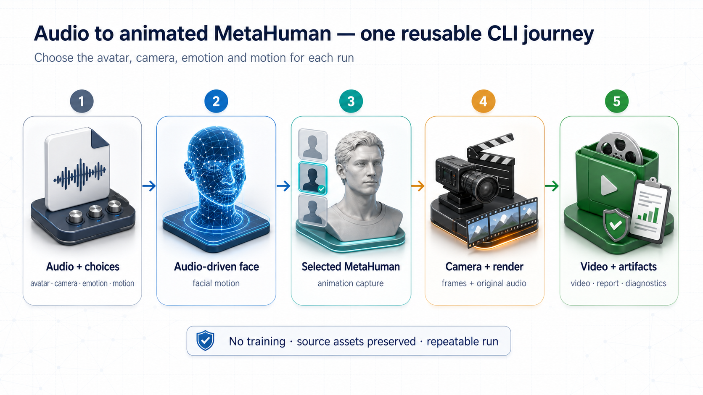

CLI는 다음 다섯 경계를 순서대로 연결한다.

1. WAV를 NIM용 16 kHz와 최종 mux용 48 kHz PCM으로 정규화한다.
2. NVIDIA 공식 `a2f_3d.py`로 v3 diffusion inference를 실행한다.
3. ACE 2.5 `AnimateCharacterFromWavFile`과 Take Recorder로 MetaHuman을 녹화한다.
4. UE 5.6 MRQ가 카메라별 PNG frame을 렌더한다.
5. 프로젝트 FFmpeg가 authoritative WAV를 AAC로 mux하고 H.264/AAC, frame 수, A/V 시작 시각, decode를 검증한다.

검증된 `test.wav` v3 실행은 약 60 fps cadence의 raw 218 sample을 실제 timecode로 30 fps/109 frame에 대응시킨다. avatar, Claire mannequin, Active Curves panel은 같은 master clock을 사용한다.

### 실행 아키텍처

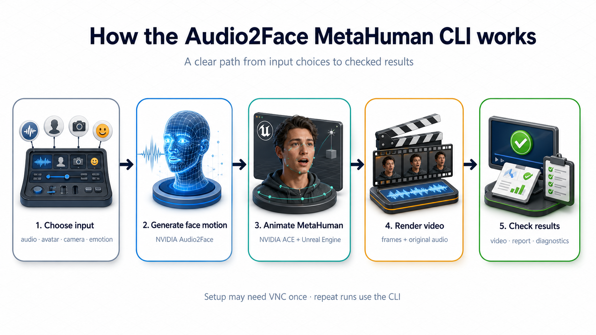

- GPU1 RTX A4500: Audio2Face v3 NIM inference
- GPU0 Quadro RTX 5000: UE 5.6 Vulkan/ACE/MRQ
- VNC `DISPLAY=:1`: 최초 Epic 인증, 결과 관찰, 문제 진단
- CLI: 반복 가능한 production 실행
- project-local FFmpeg 6.1.1: normalize, encode, audio mux, ffprobe/decode

그림은 FIGURES 지침의 hybrid workflow로 생성했다. Python Route A는 의미·화살표·수치를 고정한 semantic blueprint이고, 최종 화면은 그 blueprint를 reference로 사용해 GPT-Image Route B에서 고품질 생성했다. 후보 선정과 실패한 화살표 수정 기록은 [figure contract](assets/audio2face-hands-on/figure-contract.md), [candidate scorecard](assets/audio2face-hands-on/figure-scorecard.md), [generation prompts](assets/audio2face-hands-on/generated-figure-prompts.md)에 있다.

두 생성 그림은 재사용 가능한 일반 흐름만 설명하며 특정 포트, GPU, frame 수나 `test.wav` 결과를 보편 개념처럼 표시하지 않는다. 이 worked example의 실제 수치는 본문 결과 검증에서만 제시한다. 실제 MetaHuman frame은 생성 AI로 수정하지 않았다.

### 결과를 읽을 때 지켜야 할 경계

| 표기 | 의미 |
| --- | --- |
| `final-render applied` | 실제 ACE capture/AnimSequence/MRQ 결과에 적용되고 영상 또는 capture 증거로 검증됨 |
| `NVIDIA-inference only` | 공식 client/NIM 출력에는 적용되지만 전용 MetaHuman E2E를 이번 atlas에서 다시 렌더하지 않음 |
| `artifact/visualization only` | JSON/CSV, mannequin, curve panel만 변함. 최종 MetaHuman이 변했다고 주장하지 않음 |
| `manual_action_required` | Epic 로그인·asset import·ACE readiness처럼 사용자 UI 동작이 필요한 경계 |

## 1. 사전 점검

### 1.1 작업 디렉터리와 입력 확인

```bash
cd /home/aim/workspace/hosang/repo/facenet
test -s /home/aim/Downloads/test.wav
test -x scripts/audio2face-metahuman/run-a2f-metahuman.py
test -x .tools/ffmpeg/bin/ffmpeg
```

전체 옵션은 `--help`로 확인한다.

```bash
scripts/audio2face-metahuman/run-a2f-metahuman.py --help
```

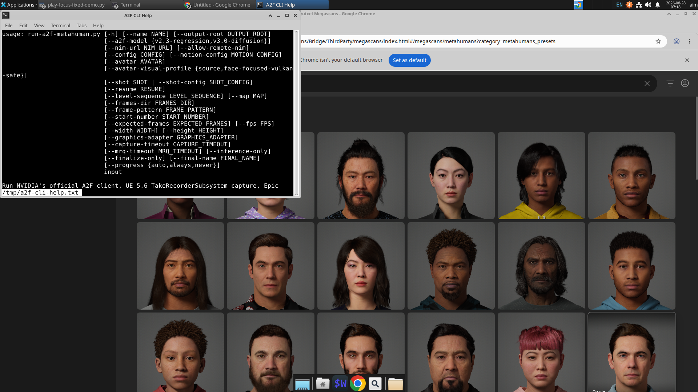

### 1.2 v3 NIM과 GPU 확인

```bash
.tools/audio2face3d/Audio2Face-3D-Samples/scripts/\
audio2face_3d_microservices_interaction_app/.venv/bin/python \
  .tools/audio2face3d/Audio2Face-3D-Samples/scripts/\
audio2face_3d_microservices_interaction_app/a2f_3d.py \
  health_check --url 127.0.0.1:52100

docker ps --format 'table {{.Names}}\t{{.Status}}\t{{.Ports}}'
nvidia-smi --query-gpu=index,name,memory.used,memory.total --format=csv,noheader
```

정상 기준:

- `Service 127.0.0.1:52100 is ONLINE`
- `audio2face-3d-diffusion`이 실행 중
- GPU1이 RTX A4500
- GPU0은 UE render용 Quadro RTX 5000

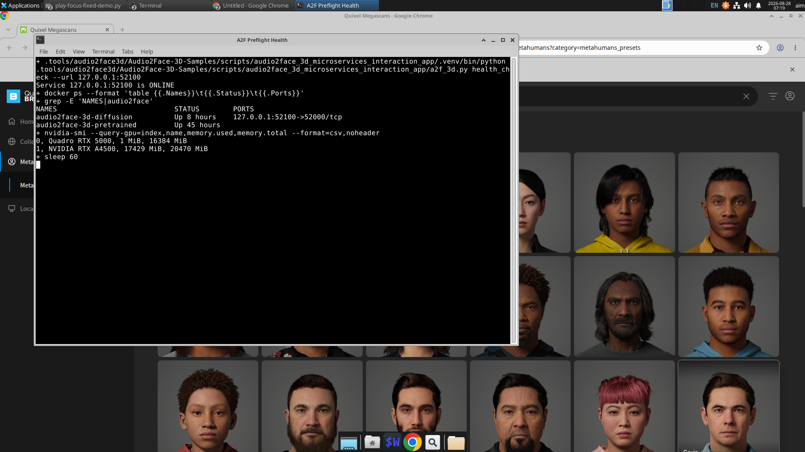

v3 service가 꺼져 있으면 다음 helper로 시작한다. 실패 시 v2로 자동 fallback하지 않는다.

```bash
scripts/audio2face-metahuman/start-a2f-v3-diffusion.sh
```

## 2. 첫 번째 v3.0 영상 만들기

### 2.1 canonical 기본 실행

```bash
scripts/audio2face-metahuman/run-a2f-metahuman.py \
  /home/aim/Downloads/test.wav \
  --name hands-on-default-v30
```

옵션을 생략해도 다음 값이 선택된다.

| 항목 | 기본값 |
| --- | --- |
| model | `v3.0-diffusion` |
| endpoint | `127.0.0.1:52100` |
| avatar | `Taro` |
| visual profile | `source` |
| shot | `close-up-front` |
| resolution/fps | 1920×1080 / 30 fps |
| progress | `auto` |

터미널에는 측정 가능한 stage만 progress로 표시된다. NIM/UE startup에는 가짜 percent 대신 spinner와 elapsed time을 사용한다.

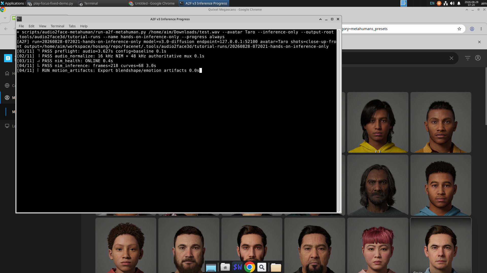

완전 실행은 다음 산출물을 만든다.

```text
<run>/manifest.json
<run>/effective-motion-config.json
<run>/official-nvidia-client/output_000001/animation_frames.csv
<run>/motion-artifacts/blendshapes.raw.json
<run>/motion-artifacts/blendshapes.effective.json
<run>/motion-artifacts/mannequin/mannequin.raw.mp4
<run>/*final.mp4
<run>/*layout-v3-triptych.mp4
<run>/verification.json
```

### 2.2 inference만 빠르게 실습

UE/MRQ 없이 공식 v3 inference와 motion artifact까지만 확인하려면 `--inference-only`를 사용한다.

```bash
scripts/audio2face-metahuman/run-a2f-metahuman.py \
  /home/aim/Downloads/test.wav \
  --avatar Taro \
  --inference-only \
  --output-root .tools/audio2face3d/tutorial-runs \
  --name hands-on-inference-only \
  --progress always
```

이 모드는 의도적으로 exit code 42와 `manual_action_required`/`inference_only_complete`를 남긴다. 실패가 아니라 “UE capture를 실행하지 않은 명시적 경계”다. 해당 manifest는 일반 `--resume` source가 아니므로, 전체 영상을 만들 때는 `--inference-only`를 제거해 새 실행한다.

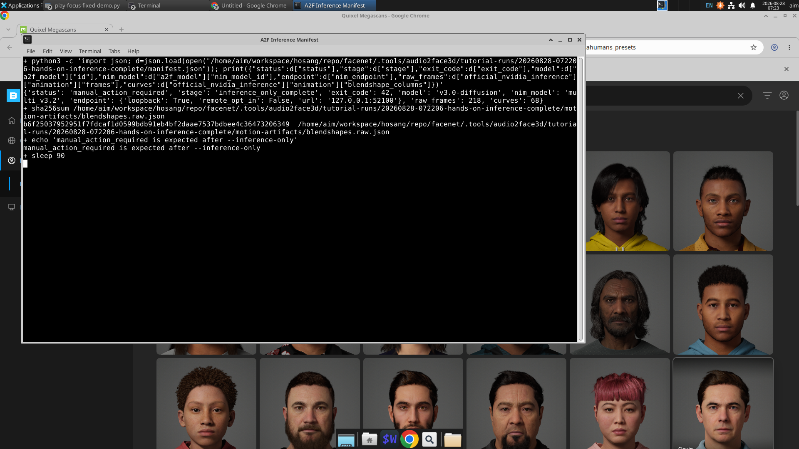

## 3. 구도와 카메라

### 3.1 named shot 네 가지

`--shot`을 반복하면 오디오 한 번으로 여러 카메라 결과를 만든다.

```bash
scripts/audio2face-metahuman/run-a2f-metahuman.py \
  /home/aim/Downloads/test.wav \
  --avatar Taro \
  --shot close-up-front \
  --shot medium-three-quarter-left \
  --shot medium-three-quarter-right \
  --shot profile-left \
  --name hands-on-four-shots
```

| preset | 거리/방위/고도 | lens | aperture | focus |
| --- | --- | ---: | ---: | ---: |
| `close-up-front` | 96.4 cm / 0° / -4° | 40 mm | f/16 | 96.4 cm |
| `medium-three-quarter-left` | 150 cm / -30° / -3° | 50 mm | f/8 | 150 cm |
| `medium-three-quarter-right` | 150 cm / +30° / -3° | 50 mm | f/8 | 150 cm |
| `profile-left` | 135 cm / -90° / -2° | 55 mm | f/8 | 135 cm |

`profile`은 `profile-left` alias다.

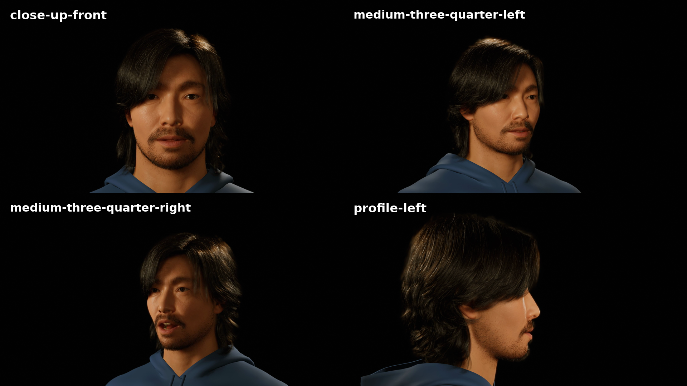

### 3.2 custom camera transform

`--shot-config`는 `--shot`과 동시에 사용할 수 없다. 다음 구조로 camera를 avatar head 좌표계에 배치한다.

```json
{
  "schema_version": 1,
  "shots": [
    {
      "id": "custom-front-50mm",
      "camera": {
        "coordinate_space": "avatar_head",
        "location_cm": [0.0, 120.0, -8.0],
        "rotation_deg": [3.8, -90.0, 0.0],
        "focal_length_mm": 50.0,
        "aperture": 8.0,
        "focus_distance_cm": 120.0
      }
    }
  ]
}
```

저장소 예제는 `scripts/audio2face-metahuman/tests/fixtures/shot-custom-front.json`이다.

```bash
scripts/audio2face-metahuman/run-a2f-metahuman.py \
  /home/aim/Downloads/test.wav \
  --avatar Taro \
  --shot-config scripts/audio2face-metahuman/tests/fixtures/shot-custom-front.json \
  --name hands-on-custom-camera
```

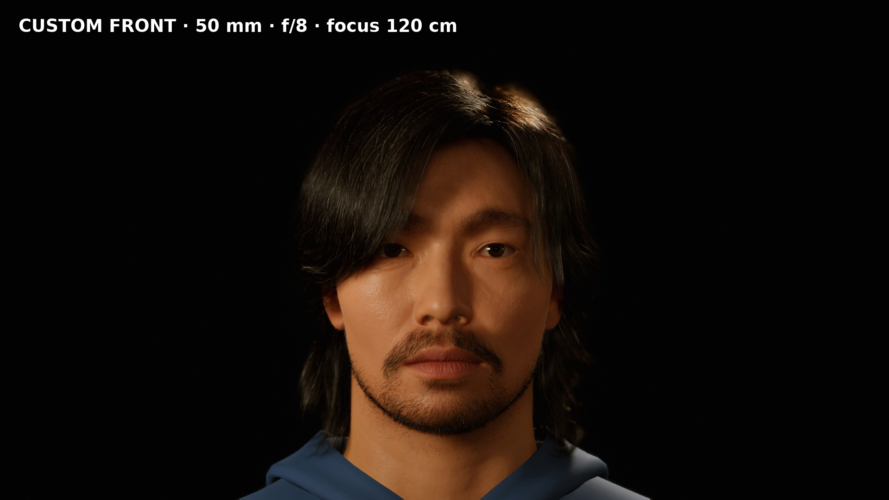

카메라 입력은 finite 값, 안전한 shot ID, focal/aperture/focus 범위 및 중복 ID를 preflight에서 검사한다. `focus_distance_cm`를 실제 subject 거리와 크게 다르게 설정하면 의도적으로 focus가 나갈 수 있다.

- custom config는 `coordinate_space`에 `avatar_head` 또는 `world`를 허용한다.
- focal length 12–300 mm, aperture f/1.2–f/32, focus 1–100,000 cm 범위를 검사한다.
- 현재 strict shot schema에는 exposure field가 없다. 알 수 없는 `exposure` key를 조용히 무시하지 않고 preflight에서 거부한다.
- 한 실행은 최대 16 shot까지 허용한다.

## 4. 아바타 선택

### 4.1 이름 또는 Unreal asset path

`--avatar`는 다음 형식을 지원한다.

```bash
--avatar Taro
--avatar BP_Taro
--avatar /Game/MetaHumans/Taro/BP_Taro
--avatar /Game/MetaHumans/Taro/BP_Taro.BP_Taro
```

Asset Registry가 `/Game/MetaHumans` 아래에서 정확히 하나의 Blueprint를 해결한다. 존재하지 않으면 임의 다운로드나 이름 추측 없이 `manual_action_required`로 중단한다.

현재 검증된 예:

```bash
# Taro
scripts/audio2face-metahuman/run-a2f-metahuman.py /home/aim/Downloads/test.wav \
  --avatar Taro --name avatar-taro

# Keiji — Linux Vulkan-safe bust profile
scripts/audio2face-metahuman/run-a2f-metahuman.py /home/aim/Downloads/test.wav \
  --avatar Keiji --avatar-visual-profile face-focused-vulkan-safe \
  --name avatar-keiji

# Sook-ja — Linux Vulkan-safe bust profile
scripts/audio2face-metahuman/run-a2f-metahuman.py /home/aim/Downloads/test.wav \
  --avatar Sook-ja --avatar-visual-profile face-focused-vulkan-safe \
  --name avatar-sookja
```

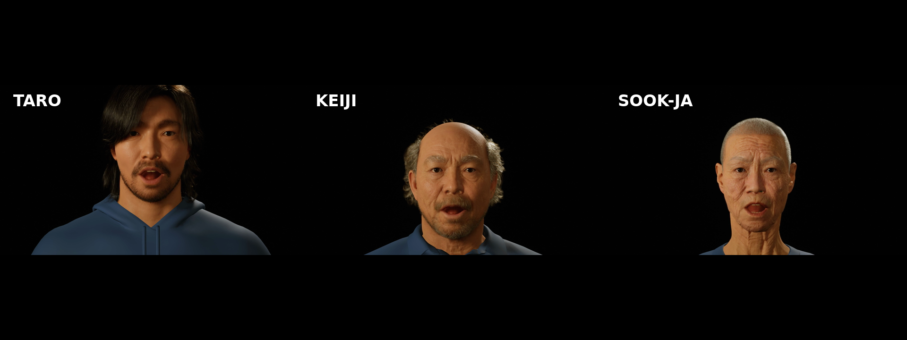

이 비교는 세 asset에서의 retarget response만 보여준다. 인종·성별·연령 전체에 대한 성능 일반화가 아니다.

로컬 `Jesse`도 `--avatar Jesse`로 해결할 수 있다. 다만 이 서버의 원본 Jesse clothing material은 UE 5.6 Linux Vulkan pipeline crash 증거가 있어 이 3-way 품질 비교에서는 제외했다. Jesse를 쓸 때도 source asset을 바꾸지 말고 run-owned 안전 profile 또는 카메라 밖 clothing 구도를 사용하며, 성공한 새 run 없이 “동일 품질 검증 완료”라고 표시하지 않는다.

### 4.2 visual profile

| `--avatar-visual-profile` | 결과 |
| --- | --- |
| `source` | 원본 MetaHuman presentation을 사용. 기본값 |
| `face-focused-vulkan-safe` | run-owned actor instance에서 Face/Body/groom을 보존하고 Torso material만 안전한 opaque material로 교체하며 Legs/Feet를 숨김 |

두 profile 모두 source Blueprint/material/map을 수정하지 않는다. 안전 profile은 Linux Vulkan clothing shader workaround이지 MetaHuman 품질 업그레이드가 아니다.

## 5. 모션 강도와 얼굴 파라미터

### 5.1 motion config 기본 구조

`--motion-config`는 strict JSON schema를 사용한다.

```json
{
  "schema_version": 1,
  "mode": "enhanced",
  "curve_application": "final_render",
  "final_render_profile": "ace-source",
  "face_parameters": {
    "lowerFaceStrength": 1.5,
    "upperFaceStrength": 1.3,
    "lowerFaceSmoothing": 0.004,
    "upperFaceSmoothing": 0.001,
    "blinkStrength": 1.15
  },
  "emotion": {
    "overall_strength": 0.9,
    "constant": {},
    "timecoded": []
  },
  "artifact_postprocess": {
    "global_intensity": 1.0,
    "attack": 0.82,
    "release": 0.58,
    "region_gains": {
      "eyes": 1.12,
      "jaw": 1.15,
      "mouth": 1.08,
      "brows": 1.18,
      "cheeks": 1.1
    },
    "curve_operations": {
      "JawOpen": {"gain": 1.08, "bias": 0.0, "clamp": [0.0, 0.92]}
    }
  }
}
```

실제 예제:

- `scripts/audio2face-metahuman/configs/motion-baseline-v1.json`
- `scripts/audio2face-metahuman/configs/motion-expressive-safe-v1.json`
- `scripts/audio2face-metahuman/configs/motion-v3-dynamic-safe-final-v1.json`
- `scripts/audio2face-metahuman/configs/motion-v3-ace-node-quality-v4.json`

### 5.2 intensity와 smoothing

```bash
scripts/audio2face-metahuman/run-a2f-metahuman.py \
  /home/aim/Downloads/test.wav \
  --avatar Taro \
  --motion-config scripts/audio2face-metahuman/configs/motion-v3-dynamic-safe-final-v1.json \
  --name taro-dynamic-safe
```

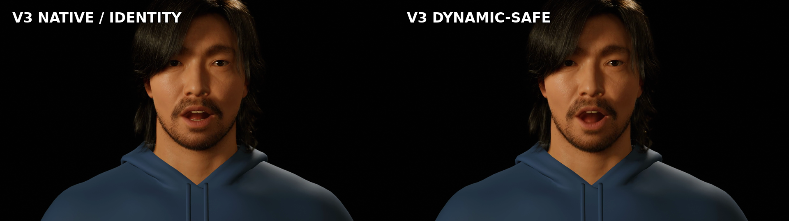

- `global_intensity`: 모든 effective curve의 공통 배율
- `region_gains`: `eyes`, `jaw`, `mouth`, `brows`, `cheeks`, `tongue` 영역별 배율
- `curve_operations`: 개별 curve의 `gain`, `bias`, `[low, high] clamp`
- `attack`: 값이 커질 때 이전 frame에서 목표값으로 접근하는 비율
- `release`: 값이 작아질 때 접근하는 비율

`attack`/`release`는 timestamp를 이동시키지 않는다. 값만 같은 frame time에서 필터링한다. 과도한 gain은 saturation/jerk를 만들 수 있으므로 raw/effective JSON과 benchmark를 함께 확인한다.

### 5.3 설치된 ACE 2.5 face parameter 전체

| 이름 | 허용 범위 | 주요 효과 |
| --- | ---: | --- |
| `skinStrength` | 0–2 | skin deformation strength |
| `upperFaceStrength` | 0–2 | brow/eye 등 upper-face strength |
| `lowerFaceStrength` | 0–2 | jaw/mouth 등 lower-face strength |
| `eyelidOpenOffset` | -1–1 | eyelid open bias |
| `blinkStrength` | 0–2 | blink source strength |
| `lipOpenOffset` | -0.2–0.2 | lip opening bias |
| `upperFaceSmoothing` | 0–0.1 | upper-face temporal smoothing |
| `lowerFaceSmoothing` | 0–0.1 | lower-face temporal smoothing |
| `faceMaskLevel` | 0–1 | face mask level |
| `faceMaskSoftness` | 0.001–0.5 | mask transition softness |
| `tongueStrength` | 0–3 | official tongue output strength |
| `tongueHeightOffset` | -3–3 | tongue vertical offset |
| `tongueDepthOffset` | -3–3 | tongue depth offset |
| `inputStrength` | 0–3 | model animation input strength |
| `blinkOffset` | -1–1 | blink bias |

알 수 없는 이름이나 범위 밖 값은 UE 시작 전에 거부된다.

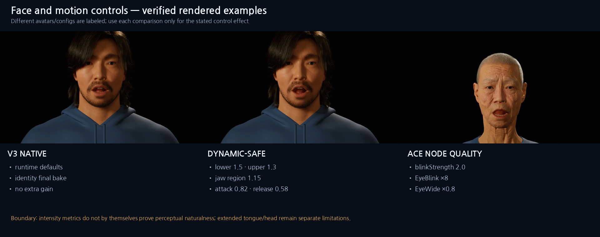

그림의 세 열은 서로 다른 설정과 일부 다른 avatar를 명시적으로 표시한다. 동일 인물 perceptual benchmark로 해석하지 않고, 각 열에 적힌 control이 실제 렌더에 존재하는지를 확인하는 hands-on 예다.

### 5.4 official ACE node multiplier/offset

최종 MetaHuman blink처럼 post-bake float curve가 이미 bake된 bone pose를 다시 계산하지 않는 경우에는 `nvidia_runtime_curve_parameters`를 사용한다.

```json
"nvidia_runtime_curve_parameters": {
  "enable_clamping": false,
  "multipliers": {
    "EyeBlinkLeft": 8.0,
    "EyeBlinkRight": 8.0,
    "EyeWideLeft": 0.8,
    "EyeWideRight": 0.8
  },
  "offsets": {}
}
```

```bash
scripts/audio2face-metahuman/run-a2f-metahuman.py \
  /home/aim/Downloads/test.wav \
  --avatar Sook-ja \
  --motion-config scripts/audio2face-metahuman/configs/motion-v3-ace-node-quality-v4.json \
  --shot close-up-front \
  --name sookja-ace-node-quality
```

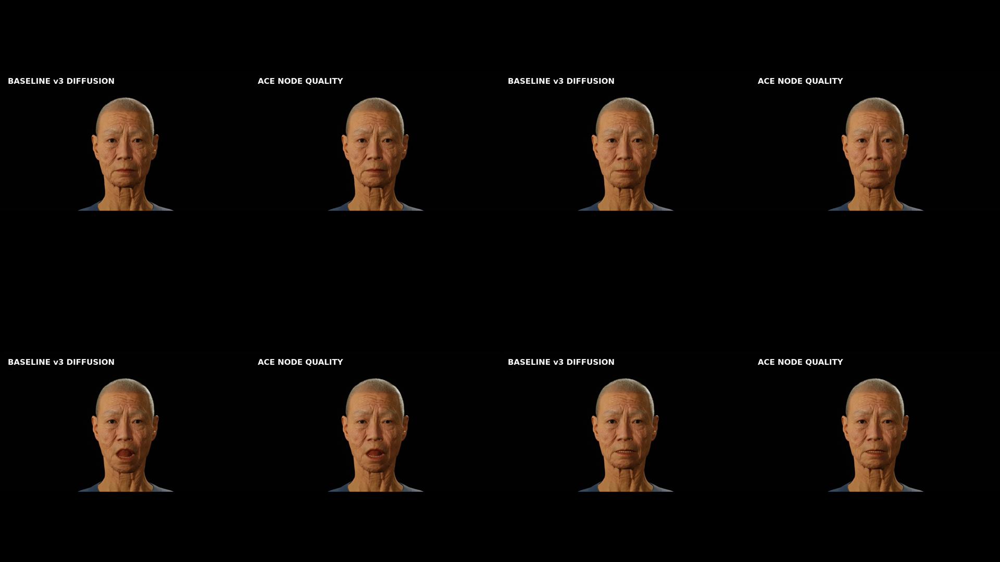

이 경로는 run-owned PIE AnimInstance의 공식 `FAnimNode_ApplyACEAnimation` map만 설정한다. capture status에 node count와 exact map SHA가 없으면 strict triptych를 거부한다.

### 5.5 실제 적용 경계

| Control | NVIDIA inference | ACE/AnimSequence | 최종 MP4 |
| --- | --- | --- | --- |
| `face_parameters` | 적용 | ACE WAV parameters | `final-render applied` |
| `nvidia_runtime_curve_parameters` | official client CSV에 적용 | ApplyACE node map | `final-render applied` + lineage/sync gate |
| `global_intensity`/`region_gains`/`curve_operations` | raw에는 미적용 | `final_render`일 때 run-owned curve bake | curve track은 적용되지만 이미 bake된 bone pose 재평가는 curve별로 별도 검증 필요 |
| `attack`/`release` | raw에는 미적용 | effective series/bake | 동일 timestamp의 값만 변화 |
| extended tongue 16 curves | A2F-68 artifact에 존재 | ACE 2.5 source stream이 소비하지 않음 | `artifact/visualization only` |

`motion-v3-eyes-tongue-safe-final-v2.json`은 extended 68-curve 진단 실험이다. mannequin 눈은 변했지만 MetaHuman 눈이 같은 방식으로 재평가되지 않았으므로 최종 권장 preset이 아니다.

## 6. 감정 제어

### 6.1 지원 감정 이름

`disgust`, `joy`, `grief`, `outofbreath`, `pain`, `amazement`, `anger`, `cheekiness`, `sadness`, `fear`의 10개 이름을 0–1 범위로 사용한다.

### 6.2 처음에는 constant emotion만 사용

```json
{
  "schema_version": 1,
  "mode": "enhanced",
  "curve_application": "final_render",
  "emotion": {
    "overall_strength": 0.9,
    "constant": {"joy": 0.7},
    "timecoded": []
  }
}
```

실행 예:

```bash
scripts/audio2face-metahuman/run-a2f-metahuman.py \
  /home/aim/Downloads/test.wav \
  --motion-config docs/assets/audio2face-hands-on/configs/motion-emotion-joy-v1.json \
  --avatar Taro \
  --name emotion-joy-render
```

같은 Taro·음성·카메라에서 neutral/auto와 constant joy 0.7만 바꾼 실제 Unreal/ACE 렌더 결과다.

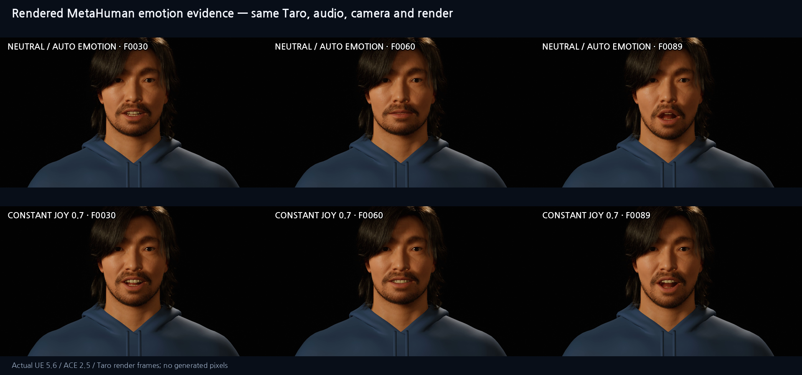

[provenance JSON](assets/audio2face-hands-on/results/07-emotion-metahuman-render.json)에 source run ID, MP4/config SHA와 선택 frame이 기록되어 있다. 이 이미지는 실제 MP4 frame을 deterministic하게 배치했으며 생성 AI pixel을 사용하지 않았다.

### 6.3 timecoded emotion은 고급 경계

```json
{
  "schema_version": 1,
  "mode": "enhanced",
  "curve_application": "artifact_only",
  "emotion": {
    "overall_strength": 0.9,
    "constant": {},
    "timecoded": [
      {"time_seconds": 0.0, "values": {"joy": 0.7}},
      {"time_seconds": 1.8, "values": {"sadness": 0.7}}
    ]
  }
}
```

중요한 경계:

- constant emotion과 `overall_strength`는 official request와 ACE `Audio2FaceEmotionOverride`에 연결된다.
- timecoded emotion은 official NVIDIA inference conditioning으로 검증됐다.
- 설치된 ACE WAV helper는 arbitrary time-series emotion 인자를 직접 받지 않는다.
- timecoded emotion은 main rendered example로 사용하지 않는다. 설치된 ACE WAV helper의 임의 time-series final-render 적용은 별도 고급 검증 경계다.
- 감정 label을 크게 지정해도 모든 phoneme frame에서 극단적 표정이 나오는 것은 아니다. audio-driven mouth motion과 emotion conditioning이 함께 solver에 들어간다.

## 7. 실행 환경 참고

처음 실습에서는 model/endpoint 옵션을 생략하고 기본 경로를 사용한다. Legacy v2가 필요한 기존 자동화만 `--a2f-model v2.3-regression`을 명시한다. hands-on 본문에서는 모델 품질 비교를 다루지 않는다.

### endpoint와 request config

- `--nim-url`: model registry 기본 endpoint 대신 명시할 때 사용
- `--allow-remote-nim`: loopback이 아닌 endpoint를 명시적으로 허용
- `--config`: NVIDIA official client request YAML. 기본값은 sample의 `config_claire.yml`

`config_claire.yml`은 model selector가 아니라 Claire request header다. 실제 v2/v3 선택은 service identity와 endpoint가 결정한다. remote URL에는 credential/query/fragment를 넣을 수 없고, non-loopback에는 반드시 `--allow-remote-nim`이 필요하다.

## 8. 렌더·복구·자동화 옵션

### 8.1 출력 이름과 위치

```bash
scripts/audio2face-metahuman/run-a2f-metahuman.py INPUT.wav \
  --name product-demo-01 \
  --output-root /safe/output/root \
  --final-name final-avatar-video
```

- `--name`: run ID suffix. 안전한 slug로 정규화
- `--output-root`: run directory parent
- `--final-name`: single-shot 최종 MP4 stem override

### 8.2 기존 NIM inference 재사용

`--resume`는 source manifest의 input/config/model/endpoint/file hash가 모두 맞을 때 official inference output만 재사용한다.

```bash
scripts/audio2face-metahuman/run-a2f-metahuman.py /home/aim/Downloads/test.wav \
  --avatar Taro \
  --resume /absolute/path/to/previous-success-run \
  --name resumed-render
```

- model 옵션을 생략하면 old v2 resume는 v2/52000, v3 resume는 v3/52100을 상속한다.
- 명시적 cross-model resume는 거부한다.
- input/config SHA가 다르면 거부한다.
- `--inference-only`의 exit 42 manifest는 resume source가 아니다.

### 8.3 caller-owned LevelSequence

이미 준비된 단일 sequence가 있으면 ACE capture를 건너뛰고 MRQ부터 실행할 수 있다.

```bash
scripts/audio2face-metahuman/run-a2f-metahuman.py INPUT.wav \
  --level-sequence /Game/Cinematics/MySequence.MySequence \
  --map /Game/Maps/MyMap.MyMap \
  --shot close-up-front
```

`--level-sequence`는 single shot만 지원하고 `/Game/...` canonical path validation을 통과해야 한다.

### 8.4 caller-owned frame을 MP4로 finalize

```bash
scripts/audio2face-metahuman/run-a2f-metahuman.py /home/aim/Downloads/test.wav \
  --finalize-only \
  --frames-dir /absolute/path/to/png-frames \
  --frame-pattern 'frame.%04d.png' \
  --start-number 0 \
  --expected-frames 109 \
  --fps 30 \
  --width 1920 \
  --height 1080 \
  --final-name finalized-demo
```

- `--finalize-only`: NIM/UE/MRQ를 건너뛰고 frame encode + authoritative input audio mux + 검증만 수행
- `--frames-dir`: single shot frame directory. finalize-only에서는 필수
- `--frame-pattern`: printf-style PNG pattern. 기본 `frame.%04d.png`
- `--start-number`: 첫 frame 번호. 기본 0
- `--expected-frames`: 예상 frame 수. 생략 시 `ceil(audio_duration × fps)`

frame directory는 symlink이거나 non-empty MRQ destination이면 거부한다. finalize-only는 caller가 제공한 기존 frame을 읽는 예외다.

### 8.5 MRQ 품질과 GPU

| 옵션 | 기본값 | 설명 |
| --- | ---: | --- |
| `--fps` | 30 | 1–240 |
| `--width` | 1920 | 16–8192 |
| `--height` | 1080 | 16–8192, 총 pixel 제한 적용 |
| `--graphics-adapter` | 0 | UE Vulkan adapter index 0–31. 이 서버의 GPU0 Quadro RTX 5000 |
| `--capture-timeout` | 420 | ACE/Take Recorder timeout, 1–3600초 |
| `--mrq-timeout` | 420 | shot별 MRQ timeout, 1–3600초 |

`CUDA_VISIBLE_DEVICES`는 CUDA/NIM 선택에는 영향을 주지만 UE Vulkan adapter 선택을 대신하지 않는다. UE는 `--graphics-adapter`를 사용한다.

### 8.6 progress 모드

| `--progress` | 동작 |
| --- | --- |
| `auto` | TTY는 spinner/bar, pipe/CI는 ANSI 없는 line output |
| `always` | redirect 여부와 무관하게 진행 UI 표시 |
| `never` | stderr progress를 끄고 machine scripting에 적합 |

모든 모드에서 machine-readable `progress-events.jsonl`은 run directory에 남고 stdout의 `SUCCESS <paths>` 계약은 유지된다.

## 9. 결과 검증

### 9.1 최종 triptych 확인

왼쪽은 최종 MetaHuman, 오른쪽 위는 실제 A2F-68로 변형한 Claire reference geometry, 오른쪽 아래는 같은 frame/time의 sorted Active Curves다.

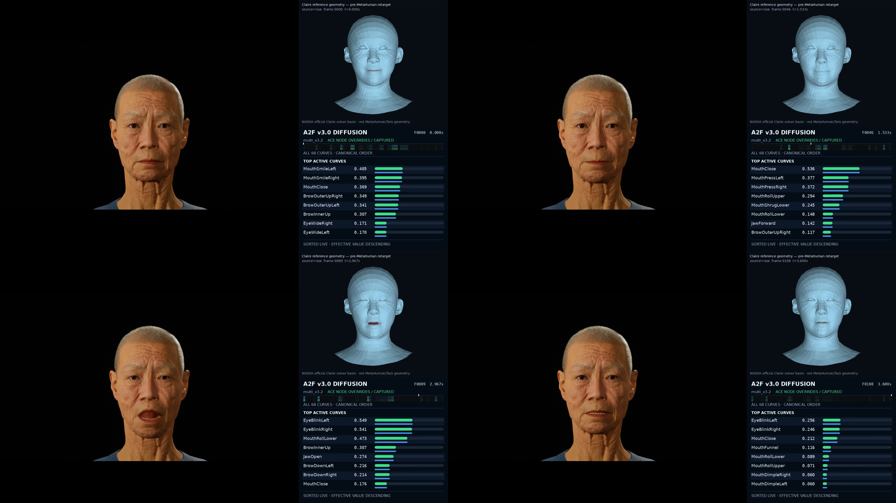

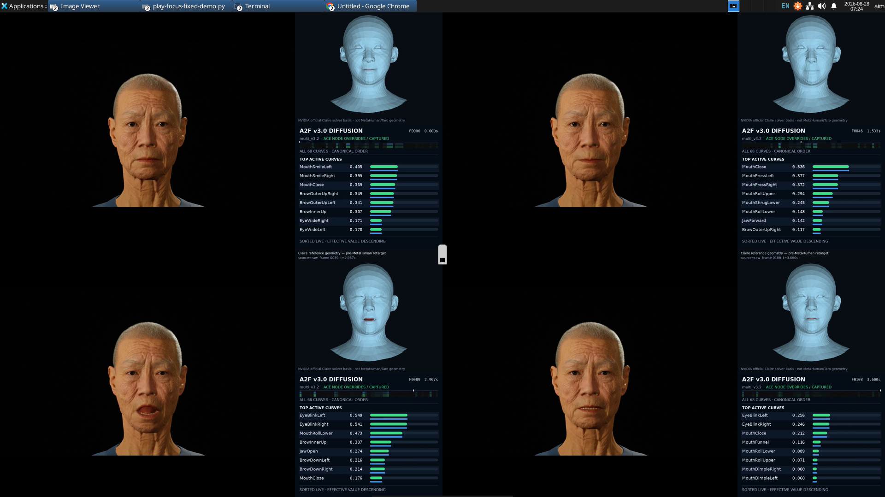

Claire mannequin은 pre-MetaHuman-retarget 진단 기준이며 선택 avatar와 픽셀상 동일한 얼굴이 아니다.

### 9.2 ffprobe와 전체 decode

```bash
VIDEO=/absolute/path/to/final.mp4

.tools/ffmpeg/bin/ffprobe -v error -count_frames \
  -show_entries stream=index,codec_type,codec_name,width,height,r_frame_rate,\
nb_read_frames,sample_rate,channels,start_time,duration \
  -of json "$VIDEO"

.tools/ffmpeg/bin/ffmpeg -v error -i "$VIDEO" \
  -map 0:v:0 -map 0:a:0 -f null -
```

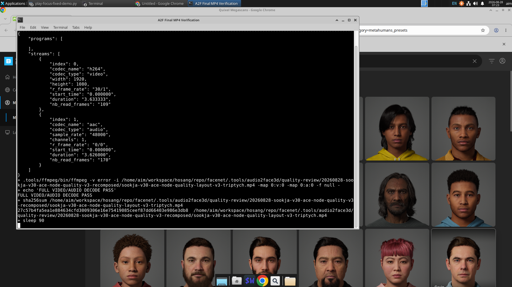

현재 예제 triptych 검증값:

| 항목 | 값 |
| --- | --- |
| video/audio codec | H.264 / AAC |
| resolution | 1920×1080 |
| fps / frame count | 30 / 109 |
| audio | 48 kHz mono |
| A/V start delta | 0 ms |
| full decode | PASS |

stream start 0 ms만으로 lip-sync를 통과시키지 않는다. final-render 또는 ACE-node trusted source는 A2F `JawOpen`과 rendered avatar optical motion의 cross-correlation도 측정하며 ±1 frame 안이어야 한다.

### 9.3 성공과 제한을 구분하기

- `SUCCESS`: requested 단계와 codec/frame/A-V/decode/lineage gate가 모두 통과
- `manual_action_required`: asset import, ACE setup 또는 명시적 inference-only boundary
- UE `VkResult=-13`: Linux Vulkan pipeline 생성의 간헐적 blocker. driver를 자동 변경하거나 무한 재시도하지 않음
- `TongueOut=0`: 해당 오디오에서 혀가 안 보이는 정확한 데이터 상태. gain으로 fake tongue를 만들지 않음
- head rotation: 설치 ACE 2.5 ApplyACE node에서 구현 비활성. 지원된다고 표시하지 않음

## 부록 A. CLI control-path audit

각 입력이 단지 manifest에 저장되는 데 그치지 않고 어디까지 전달되는지 추적한 표다.

| 사용자 입력 | validation/해결 | NVIDIA/ACE | Sequence/MRQ | 최종 증거 |
| --- | --- | --- | --- | --- |
| model/endpoint | `resolve_model_profile`, local port binding | official client와 ACE connection이 같은 endpoint 사용 | capture lineage에 model/endpoint 기록 | manifest runtime/model digest, cadence gate |
| avatar | Asset Registry name/path exact match | Face_AnimBP와 ACE curve source readiness | run-owned actor/map, face track 1개 | avatar asset path와 source-modified=false |
| named shot | preset alias/중복/최대 16개 검사 | 해당 없음 | `resolved_camera`→CineCamera→CameraCut→shot MRQ | shot manifest와 camera transform |
| custom camera | strict 6-field schema, finite/range 검사 | 해당 없음 | transform/orbit, lens, aperture, manual focus | `capture-status.json` resolved camera |
| face parameters | installed ACE 이름/범위 검사 | request YAML + `create_audio2_face_parameters().batch_set_parameters()` | Take Recorder가 결과를 capture | effective config, capture log, MP4 |
| constant emotion | canonical 10-name/0–1 검사 | request conditioning + ACE emotion override | captured animation | config/request/capture provenance |
| timecoded emotion | 증가 timecode/audio duration 검사 | official request conditioning | ACE WAV helper direct time-series 인자 없음 | JSON/CSV/mannequin은 검증, final avatar는 경계 표시 |
| runtime curve map | ACE source 52 name/범위 검사 | official client + `FAnimNode_ApplyACEAnimation` exact map | runtime pose를 Take Recorder capture | node count/map SHA + optical sync |
| artifact postprocess | 68 curve/region/gain/bias/clamp 검사 | raw 보존, effective 별도 생성 | opt-in run-owned curve bake | raw/effective SHA와 적용 경계 |
| resolution/fps | numeric/pixel/frame limits | 해당 없음 | MRQ config와 master clock | ffprobe width/height/fps/frame count |
| finalize options | pattern/start/count/path 검사 | NIM/ACE 생략 | caller frame 사용 | H.264/AAC/mux/decode verification |
| resume | source status/input/config/file hash 검사 | verified inference만 재사용 | 새 capture/MRQ | `resumed_from`, 동일 model/endpoint |
| progress | mode enum 검사 | 각 real stage event | MRQ frame count polling | stderr UI + `progress-events.jsonl` |

## 전체 CLI 옵션 레퍼런스

<!-- AUTO-GENERATED FROM run-a2f-metahuman.py --help AND VERIFIED AGAINST SOURCE -->

| 옵션 | 기본값/요구 | 실제 결과 또는 경계 |
| --- | --- | --- |
| `input` | 필수 positional WAV | NIM 16 kHz와 mux 48 kHz PCM을 생성하는 authoritative 입력 |
| `-h`, `--help` | 선택 | 전체 usage와 option 목록 출력 후 종료 |
| `--name` | input stem | run ID/output stem label |
| `--output-root` | `.tools/audio2face3d/official-cli-runs` | 새 run directory parent |
| `--a2f-model` | `v3.0-diffusion` | v3 diffusion 또는 explicit legacy `v2.3-regression` |
| `--nim-url` | model registry | v3 52100, v2 52000; crosswire 거부 |
| `--allow-remote-nim` | false | non-loopback endpoint 명시적 opt-in |
| `--config` | official `config_claire.yml` | NVIDIA request header. model selector가 아님 |
| `--motion-config` | native default | face/emotion/intensity/camera와 별개인 strict motion JSON |
| `--avatar` | `Taro` | 이름, BP 이름 또는 canonical `/Game/...` path |
| `--avatar-visual-profile` | `source` | `source` 또는 run-owned `face-focused-vulkan-safe` |
| `--shot` | `close-up-front` | 반복 가능한 named shot. `--shot-config`와 상호 배타적 |
| `--shot-config` | 없음 | versioned named/custom camera JSON, 최대 1 MiB |
| `--resume` | 없음 | hash/model/endpoint가 일치하는 성공 inference 경계 재사용 |
| `--level-sequence` | 없음 | caller-owned single-shot sequence, ACE capture 생략 |
| `--map` | `/Game/Maps/TaroA2F/TaroFaceBodyDemo_Repaired` | run/caller LevelSequence를 평가할 안전한 base map |
| `--frames-dir` | run shot의 `frames/` | single shot MRQ destination; finalize-only에서는 필수 source |
| `--frame-pattern` | `frame.%04d.png` | PNG sequence printf pattern |
| `--start-number` | 0 | sequence 첫 frame 번호 |
| `--expected-frames` | `ceil(duration×fps)` | 1–36,000, exact encode/verification gate |
| `--fps` | 30 | MRQ/encode/master-clock fps, 1–240 |
| `--width` | 1920 | MRQ/encode width |
| `--height` | 1080 | MRQ/encode height |
| `--graphics-adapter` | 0 | UE Vulkan GPU index. CUDA device env와 별개 |
| `--capture-timeout` | 420 | ACE/Take Recorder timeout seconds |
| `--mrq-timeout` | 420 | shot별 MRQ timeout seconds |
| `--inference-only` | false | NIM + artifacts까지만 수행, exit 42 boundary |
| `--finalize-only` | false | caller frame + input WAV로 encode/mux/verify |
| `--final-name` | 자동 stem | single-shot 최종 MP4 이름 override |
| `--progress` | `auto` | `auto`, `always`, `never` |

<!-- END AUTO-GENERATED CLI OPTION REFERENCE -->

## 실습 결과 재현 정보

| 증거 | 위치/식별자 |
| --- | --- |
| 실제 tutorial inference-only | `.tools/audio2face3d/tutorial-runs/20260828-072206-hands-on-inference-complete` |
| v3 dynamic Taro | `20260827-165227-v30-dynamic-final-r3` |
| three-avatar benchmark | `20260827-taro-route-two-avatar-audit/three-avatar-benchmark` |
| ACE-node Sook-ja quality | `.tools/audio2face3d/quality-review/20260828-sookja-v30-ace-node-quality-v3-recomposed` |
| emotion official inference atlas | `.tools/audio2face3d/tutorial-emotion-atlas` |

관련 production 구조와 최신 known limitation은 [범용 CLI 가이드](audio2face-metahuman-cli.ko.md)에서 확인한다.
