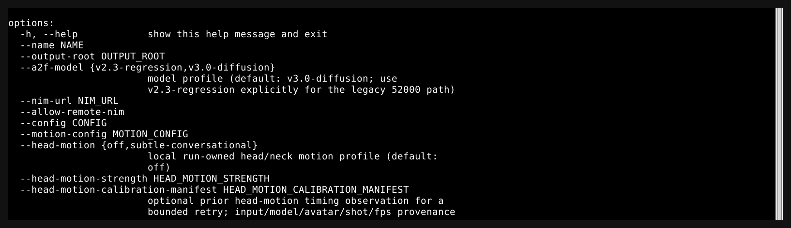
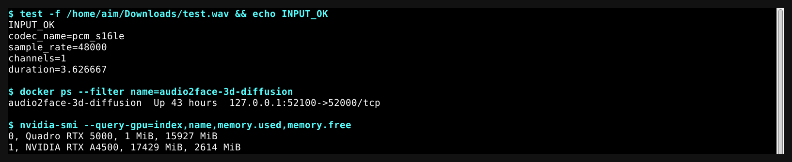
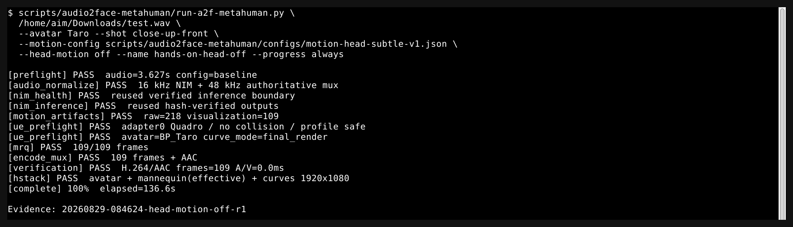
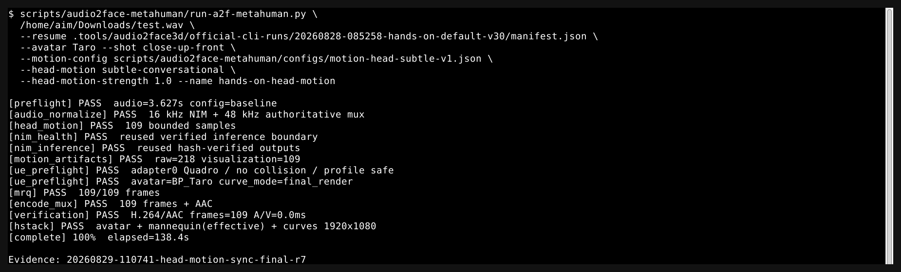
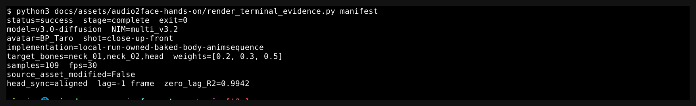
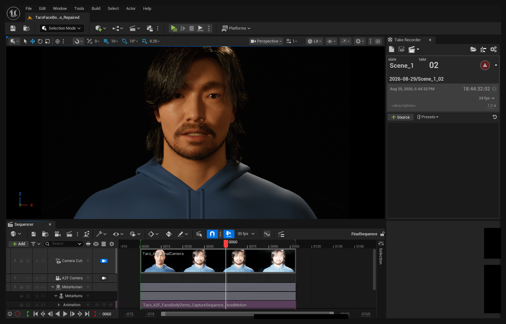
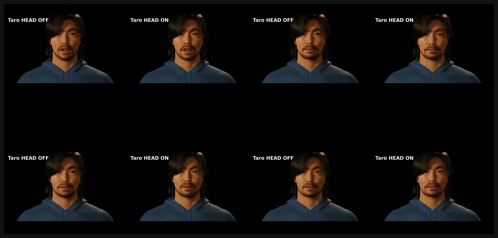
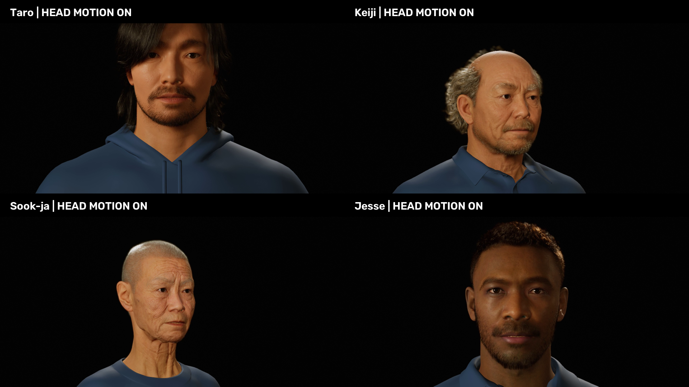
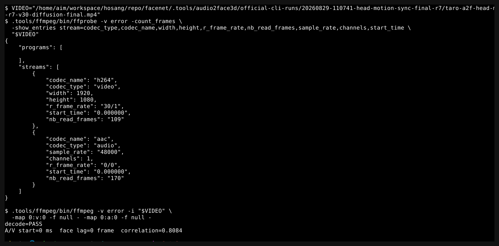
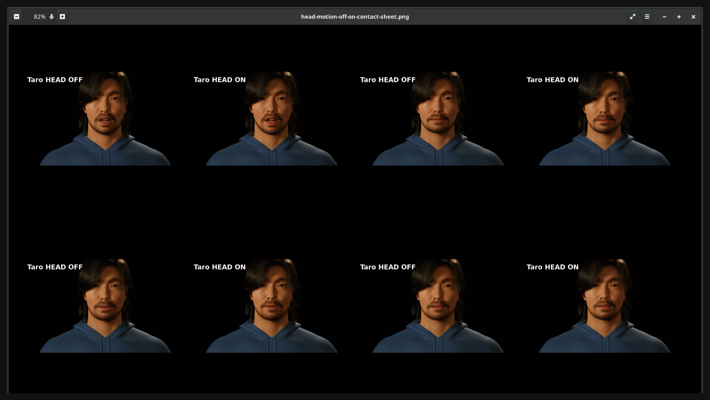

# Audio2Face-3D + MetaHuman CLI 핸즈온 튜토리얼

이 문서는 처음 사용하는 사람이 한 개의 WAV 파일을 실제 MetaHuman 발화 영상으로 만들고, 선택적으로 자연스러운 머리 움직임을 더한 뒤 codec·A/V·얼굴·머리 동기까지 검증하는 절차를 설명한다. 모든 명령은 `/home/aim/workspace/hosang/repo/facenet`에서 실행한다.

> 이 문서의 머리 움직임은 NVIDIA Audio2Face-3D나 ACE가 생성한 출력이 아니다. 입력 오디오에 반응하는 회전 sample을 run-owned Body/Face AnimSequence에 bake하는 로컬 UE 5.6 확장이다.

## 1. 결과와 5분 Quick Start

설치와 MetaHuman import가 끝난 이 서버에서는 다음 baseline 명령으로 얼굴 애니메이션 MP4를 만든다. 이후 6절에서 같은 실행을 `--resume`하여 머리 움직임을 켠다.

```bash
cd /home/aim/workspace/hosang/repo/facenet

scripts/audio2face-metahuman/run-a2f-metahuman.py \
  /home/aim/Downloads/test.wav \
  --avatar Taro \
  --shot close-up-front \
  --motion-config scripts/audio2face-metahuman/configs/motion-head-subtle-v1.json \
  --head-motion off \
  --name hands-on-head-off \
  --progress always
```

정상 실행의 마지막 줄은 `SUCCESS /absolute/path/to/final.mp4`다. 이번 `test.wav` worked example은 약 3.63초, 30 fps, 109 frames다. 다른 입력의 frame 수는 `ceil(audio_duration × fps)`로 자동 계산한다.



이 문서에서 최종적으로 확인할 결과는 다음과 같다.

- 선택한 MetaHuman이 입력 음성에 맞춰 말한다.
- 최종 MP4는 H.264 video와 authoritative WAV 기반 AAC audio를 포함한다.
- `--head-motion subtle-conversational`을 켜면 고정 카메라에서 목·머리가 부드럽게 움직인다.
- `manifest.json`, `verification.json`, motion CSV/JSON, frame map과 MP4가 한 run directory에 남는다.
- 실패하면 성공으로 가장하지 않고 stage·exit code·log·resume 경계를 남긴다.

## 2. 용어와 시스템 개요

### 2.1 용어 ledger

| 용어 | 이 문서에서의 뜻 |
| --- | --- |
| NVIDIA Audio2Face-3D v3.0 diffusion | 음성을 얼굴 애니메이션 데이터로 변환하는 기본 모델 프로필 `v3.0-diffusion` |
| NIM `multi_v3.2` | 설치된 v3 diffusion 추론 서비스의 model ID. 기본 endpoint는 `127.0.0.1:52100` |
| NVIDIA ACE 2.5 | Audio2Face 결과를 Unreal MetaHuman 얼굴 animation 경로에 연결하는 플러그인 |
| Unreal Engine 5.6 | Take Recorder, AnimSequence, Sequencer와 MRQ가 실행되는 렌더 환경 |
| MetaHuman | `/Game/MetaHumans/.../BP_*`로 해결되는 Unreal character |
| Movie Render Queue (MRQ) | Level Sequence를 frame으로 렌더하는 Unreal 기능 |
| run-owned | 현재 실행 전용 경로에 만든 asset. 원본 MetaHuman asset과 분리된다. |
| final-render applied | control이 최종 MetaHuman MP4에 적용되고 capture/render 증거가 있는 상태 |
| inference-only | NIM CSV/JSON과 진단 artifact까지만 만들고 UE/MRQ를 생략하는 경계 |
| resume | hash·model·endpoint가 일치하는 이전 성공 inference를 재사용하는 방식 |
| face-focused-vulkan-safe | run-owned 의상 material만 안정적인 opaque material로 바꾸는 Linux Vulkan workaround |
| A/V 동기 | final MP4의 video/audio 시작 시각과 길이 정합 |
| 얼굴 content 동기 | A2F `JawOpen`과 실제 렌더 얼굴 움직임의 frame-level 정합 |
| 머리 동기 | 계획한 head pose와 실제 렌더 optical motion의 frame-level 정합 |
| Claire 기준 얼굴 | MetaHuman retarget 전 A2F curve 변형을 보여 주는 진단 얼굴. 선택 MetaHuman과 동일 얼굴이 아니다. |
| master clock | avatar·진단 panel·audio가 함께 따르는 source audio seconds |

### 2.2 한 번의 명령에서 일어나는 일


실행 순서는 왼쪽에서 오른쪽이다.

1. 입력 WAV를 NIM용 16 kHz mono와 최종 mux용 48 kHz mono PCM으로 정규화한다.
2. Audio2Face-3D NIM이 얼굴 animation과 emotion 시계열을 만든다.
3. ACE가 WAV animation을 MetaHuman에 적용하고 UE Take Recorder가 run-owned animation을 기록한다.
4. Sequencer와 MRQ가 고정 camera shot을 PNG frame으로 렌더한다.
5. project-local FFmpeg가 authoritative WAV를 AAC로 mux하고 codec·A/V·얼굴·머리 동기를 검증한다.

NVIDIA의 공식 제품 역할은 [Audio2Face-3D support matrix](https://docs.nvidia.com/ace/audio2face-3d-microservice/latest/text/support-matrix.html)와 [ACE Unreal Plugin 2.5 Audio2Face 문서](https://docs.nvidia.com/ace/ace-unreal-plugin/2.5/ace-unreal-plugin-audio2face.html)를 따른다. 이 저장소의 local head motion은 [UE 5.6 `IAnimationDataController`](https://dev.epicgames.com/documentation/en-us/unreal-engine/API/Runtime/Engine/IAnimationDataController?application_version=5.6)를 사용하는 별도 확장이다.

## 3. 사전 요구사항과 최초 1회 설정

### 3.1 이 서버에서 사용하는 경로

| 구성 | 경로·버전 |
| --- | --- |
| canonical CLI | `scripts/audio2face-metahuman/run-a2f-metahuman.py` |
| Audio2Face-3D 기본 모델 | `v3.0-diffusion`, NIM `multi_v3.2`, `127.0.0.1:52100` |
| Unreal Engine | `.tools/audio2face-metahuman/UE_5.6`, UE 5.6 |
| ACE | NV_ACE_Reference 2.5 |
| UE project | `.tools/audio2face-metahuman/KairosSample/KairosSample.uproject` |
| FFmpeg | `.tools/ffmpeg/bin/ffmpeg` |
| FFprobe | `.tools/ffmpeg/bin/ffprobe` |
| 기본 output root | `.tools/audio2face3d/official-cli-runs/` |
| VNC | `DISPLAY=:1`, `XAUTHORITY=/home/aim/.Xauthority` |

시스템 `/usr/bin/ffmpeg`, driver, CUDA, TensorRT를 변경하지 않는다. 두 NIM container도 CLI가 자동 중지하거나 legacy v2로 fallback하지 않는다.

### 3.2 Unreal/MetaHuman 최초 설정

다음 준비는 avatar마다 최초 한 번 필요하다.

- MetaHuman이 `/Game/MetaHumans/<Name>/BP_<Name>`에 존재한다.
- Face, Body, DNA/skeleton과 Face AnimBP가 정상이다.
- ACE Audio Curve Source와 NVIDIA A2F pose mapping이 준비돼 있다.
- Python Editor Script, Take Recorder, Movie Render Pipeline 관련 plugin이 활성화돼 있다.
- MRQ는 [Epic Take Recorder](https://dev.epicgames.com/documentation/en-us/unreal-engine/take-recorder-in-unreal-engine?application_version=5.6)와 [MRQ command-line rendering](https://dev.epicgames.com/documentation/en-us/unreal-engine/using-command-line-rendering-with-move-render-queue-in-unreal-engine?application_version=5.6) 경로를 사용한다.

Epic 로그인, MFA, MetaHuman/Fab 라이선스 동의가 필요하면 해당 공식 GUI에서 사용자가 직접 완료한다. CLI는 credential·cookie·token을 읽거나 우회하지 않는다.

## 4. Stage 1: 입력과 runtime 확인

### 목적

비용이 큰 UE 실행 전에 입력 audio, v3 NIM, GPU 역할과 필수 binary가 준비됐는지 확인한다.

### 명령

```bash
cd /home/aim/workspace/hosang/repo/facenet

test -f /home/aim/Downloads/test.wav && echo INPUT_OK

.tools/ffmpeg/bin/ffprobe -v error \
  -show_entries format=duration:stream=codec_name,sample_rate,channels \
  -of default=nw=1 \
  /home/aim/Downloads/test.wav

docker ps --filter name=audio2face-3d-diffusion \
  --format '{{.Names}}  {{.Status}}  {{.Ports}}'

nvidia-smi \
  --query-gpu=index,name,memory.used,memory.free \
  --format=csv,noheader
```

### 예상 상태

- 입력 파일은 존재하고 `ffprobe`가 duration과 audio stream을 반환한다.
- `audio2face-3d-diffusion`은 `Up`이며 host 52100이 container 52000에 연결된다.
- GPU0 Quadro RTX 5000은 UE/Vulkan 렌더, GPU1 RTX A4500은 NIM을 담당한다.



### 산출물

이 단계는 파일을 생성하지 않는다. 후속 실행은 같은 정보를 `manifest.json`과 `head-motion-preflight.json`에 다시 기록한다.

### 통과 기준

명령이 exit 0이고 input, NIM container, GPU0/GPU1이 모두 식별된다.

### 실패와 복구

- 입력이 없으면 실제 WAV 경로를 수정한다.
- v3 NIM이 offline이면 `scripts/audio2face-metahuman/start-a2f-v3-diffusion.sh`로 동일 서비스를 확인한다. v2로 자동 fallback하지 않는다.
- GPU0에 active UnrealEditor가 있으면 병렬 Editor를 실행하지 않는다.

### 경계

높은 GPU1 resident memory만으로 UE crash 원인을 단정하지 않는다. Keiji의 알려진 crash는 GPU0 Vulkan material PSO이며 `VkResult=-13`은 OOM이 아니라 `VK_ERROR_UNKNOWN`이다.

## 5. Stage 2: baseline 얼굴 애니메이션 만들기

### 목적

머리 움직임을 끈 상태에서 NIM→ACE→Take Recorder→MRQ→mux 전체 경로가 통과하는지 확인하고, 같은 avatar/shot의 실제 얼굴 render latency를 calibration으로 저장한다.

### 명령

```bash
scripts/audio2face-metahuman/run-a2f-metahuman.py \
  /home/aim/Downloads/test.wav \
  --avatar Taro \
  --shot close-up-front \
  --motion-config scripts/audio2face-metahuman/configs/motion-head-subtle-v1.json \
  --head-motion off \
  --name hands-on-head-off \
  --progress always
```

### 예상 상태

터미널에서 `preflight`, `audio_normalize`, `nim_health`, `nim_inference`, `motion_artifacts`, `capture`, `mrq`, `encode_mux`, `verification`, `hstack`이 순서대로 PASS한다. MRQ만 `current/expected` frame 진행률을 표시하고, NIM/UE startup은 허위 percent 대신 상태와 elapsed time을 표시한다.



### 산출물

```text
.tools/audio2face3d/official-cli-runs/<timestamp>-hands-on-head-off/
  manifest.json
  capture-status.json
  verification.json
  progress-events.jsonl
  motion-artifacts/
  frames/
  *-final.mp4
  *-triptych.mp4
```

터미널이 출력한 run directory의 `manifest.json` 절대 경로를 기록한다. 다음 절의 `BASELINE_MANIFEST`로 사용한다.

### 통과 기준

- manifest: `status=success`, `stage=complete`, `exit_code=0`
- H.264 video와 AAC audio가 존재한다.
- full decode PASS, A/V start delta가 허용 범위다.
- 얼굴 content sync가 `aligned`이고 lag가 ±1 frame 이하다.

### 실패와 복구

manifest의 `stage`, `error`, 관련 log를 먼저 확인한다. baseline이 실패한 상태에서 head motion으로 넘어가지 않는다. 같은 NIM inference를 다시 쓰려면 성공 manifest만 `--resume`할 수 있다.

### 경계

baseline은 머리 움직임 검증이 아니다. `--head-motion` 기본값은 `off`이며 camera나 actor root를 움직이지 않는다.

## 6. Stage 3: 자연스러운 머리 움직임 켜기

### 목적

baseline의 얼굴 latency를 재사용해, 같은 master clock에서 목·머리 bone이 음성 activity에 반응하도록 한다.

### 명령

새 baseline을 사용하려면 실제 출력 경로로 바꾼다.

```bash
BASELINE_MANIFEST=/absolute/path/from-baseline/manifest.json

scripts/audio2face-metahuman/run-a2f-metahuman.py \
  /home/aim/Downloads/test.wav \
  --resume "$BASELINE_MANIFEST" \
  --avatar Taro \
  --shot close-up-front \
  --motion-config scripts/audio2face-metahuman/configs/motion-head-subtle-v1.json \
  --head-motion subtle-conversational \
  --head-motion-strength 1.0 \
  --name hands-on-head-motion \
  --progress always
```

이 저장소에서 그대로 확인 가능한 authoritative worked example은 다음 baseline을 사용했다.

```bash
scripts/audio2face-metahuman/run-a2f-metahuman.py \
  /home/aim/Downloads/test.wav \
  --resume .tools/audio2face3d/official-cli-runs/20260828-085258-hands-on-default-v30/manifest.json \
  --avatar Taro \
  --shot close-up-front \
  --motion-config scripts/audio2face-metahuman/configs/motion-head-subtle-v1.json \
  --head-motion subtle-conversational \
  --head-motion-strength 1.0 \
  --name hands-on-head-motion-verified \
  --progress always
```

### 예상 상태

baseline stage에 `head_motion`이 추가된다. 이번 `test.wav`에서는 `109 bounded samples`가 표시됐지만 frame 수는 입력 길이와 fps에 따라 달라진다.



### 구현과 control

기본값은 `off`다. `subtle-conversational`은 random jitter 없이 deterministic 저주파 움직임을 만든다.

| Control | 범위 | preset 값 | 의미 |
| --- | ---: | ---: | --- |
| `--head-motion-strength` | 0.0–1.5 | 1.0 | 전체 머리 움직임 강도 |
| `pitch_limit_deg` | 0–6° | 2.5° | 위·아래 회전 상한 |
| `yaw_limit_deg` | 0–8° | 4.0° | 좌·우 회전 상한 |
| `roll_limit_deg` | 0–4° | 1.5° | 기울기 상한 |
| `smoothing_seconds` | 0.08–0.8 s | 0.22 s | rapid jitter를 줄이는 시간 상수 |
| `silence_threshold_dbfs` | -60–-25 dBFS | -42 dBFS | 음성 activity 판단 기준 |

Body의 `neck_01`, `neck_02`, `head`에는 0.2/0.3/0.5로 회전을 분배한다. 독립 Face mesh의 `head`에도 같은 master clock을 bake한다. silent tail에서는 neutral로 수렴한다.

### 산출물

```text
<run>/head-motion/
  head-motion.samples.json
  head-motion.samples.csv
  head-motion.applied.samples.json
  head-motion.metrics.json

<run>/
  head-motion-preflight.json
  manifest.json
  capture-status.json
  verification.json
  *-final.mp4
  *-triptych.mp4
```

source sample과 post-render latency를 보상한 applied sample은 별도 SHA로 저장한다.

다음 네 파일은 canonical CLI가 모든 run에 자동 생성하는 파일이 아니다. authoritative r7에 대해 OFF/ON benchmark와 optical QA를 추가 수행한 worked-example sidecar다.

```text
20260829-110741-head-motion-sync-final-r7/
  head-motion-final-verification.json
  head-motion-rendered-optical-metrics.json
  head-motion-off-on-comparison.mp4
  head-motion-off-on-contact-sheet.png
```







### 통과 기준

authoritative run `20260829-110741-head-motion-sync-final-r7`은 다음을 통과했다.

- implementation: `local-run-owned-baked-body-animsequence`
- target bones: `neck_01`, `neck_02`, `head`
- Body/Face run-owned animation 생성, source asset 수정 없음
- fixed camera 동일, actor-root transform track 없음
- 얼굴 lag 0 frame, correlation 0.8084
- 계획 head pose와 렌더 optical motion best lag -1 frame(허용 ±1)
- zero-lag mean R² 0.9942
- H.264 1920×1080, AAC 48 kHz mono, A/V 0 ms, full decode PASS

### 실패와 복구

일반 경로는 같은 input/avatar/shot/fps의 성공 baseline을 `--resume`한다. 실행별 얼굴 latency가 baseline과 2 frames 이상 달라 `head_motion_sync` exit 44가 발생하면 prior attempt가 생성한 provenance-checked observation으로 한 번 bounded retry할 수 있다.

```bash
--head-motion-calibration-manifest /absolute/path/to/head-motion-retry-calibration.json
```

이 옵션은 임의 frame 숫자를 받지 않는다. input/model/avatar/shot/fps와 correlation evidence가 일치해야 하고, 최종 residual은 여전히 ±1 frame 이하여야 한다.

### 경계

이 기능은 NVIDIA-generated head motion이 아니다. 설치 ACE 2.5의 `HeadBone` 적용 경로는 구현 비활성 상태다. 실제 movement는 local run-owned AnimSequence와 최종 픽셀에서 함께 검증한다.

## 7. Stage 4: MetaHuman과 안전한 visual profile 선택

### 목적

같은 audio/face animation을 다른 MetaHuman에 적용하면서 source asset과 Linux Vulkan 안전 경계를 보존한다.

### 명령

다음 두 명령은 avatar resolution과 visual profile을 설명하는 head-OFF 예다. Taro는 검증된 source profile을 사용할 수 있다.

```bash
scripts/audio2face-metahuman/run-a2f-metahuman.py \
  /home/aim/Downloads/test.wav \
  --avatar Taro \
  --shot close-up-front \
  --name taro-v3
```

Keiji, Sook-ja, Jesse는 이 Linux UE 5.6 stack에서 run-owned safe profile을 사용한다.

```bash
scripts/audio2face-metahuman/run-a2f-metahuman.py \
  /home/aim/Downloads/test.wav \
  --avatar Keiji \
  --avatar-visual-profile face-focused-vulkan-safe \
  --shot medium-three-quarter-left \
  --name keiji-v3-safe
```

`--avatar`에는 `Taro`, `BP_Taro`, `/Game/MetaHumans/Taro/BP_Taro.BP_Taro` 형식을 사용할 수 있다.

### 예상 상태

CLI는 Asset Registry에서 avatar를 해결하고 canonical object path와 resolution method를 manifest에 기록한다. safe profile은 Face, Body와 grooms를 유지하고 run-owned Torso material을 안정적인 opaque material로 바꾸며 camera 밖 Legs/Feet를 숨긴다.



### 산출물

avatar별 새 run directory, run-owned map/actor/animation, final MP4와 verification JSON이 생성된다. 원본 `BP_*`, material, skeleton과 map은 수정하지 않는다.

### 통과 기준

로컬 네 avatar의 실제 검증 결과는 다음과 같다.

| Avatar | Profile | Face lag / correlation | Head lag / R² | 결과 |
| --- | --- | --- | --- | --- |
| Taro | source | 0 / 0.808 | -1 / 0.995 | PASS |
| Keiji | face-focused-vulkan-safe | 0 / 0.825 | 0 / 0.996 | PASS |
| Sook-ja | face-focused-vulkan-safe | 0 / 0.956 | 0 / 0.998 | PASS |
| Jesse | face-focused-vulkan-safe | 0 / 0.938 | 0 / 0.998 | PASS |

표의 head-motion ON 결과는 위의 단일 avatar-resolution 명령만으로 생기지 않는다. 각 avatar/shot에서 Stage 2의 head-OFF baseline을 먼저 만든 뒤 Stage 3처럼 동일 manifest를 resume해야 한다. 예를 들어 검증된 Keiji 경로는 다음과 같다.

```bash
scripts/audio2face-metahuman/run-a2f-metahuman.py \
  /home/aim/Downloads/test.wav \
  --resume .tools/audio2face3d/official-cli-runs/20260828-164558-keiji-v3-test-safe/manifest.json \
  --avatar Keiji \
  --avatar-visual-profile face-focused-vulkan-safe \
  --shot medium-three-quarter-left \
  --motion-config scripts/audio2face-metahuman/configs/motion-head-subtle-v1.json \
  --head-motion subtle-conversational \
  --head-motion-strength 1.0 \
  --name keiji-head-motion-verified
```

### 실패와 복구

- avatar가 없으면 official Fab/MetaHuman Creator/Bridge import 화면에서 사용자 인증·승인을 완료한다.
- ACE readiness가 없으면 Face/Body/DNA/AnimBP와 curve source를 먼저 복구한다.
- Keiji source clothing은 실행하지 않는다. safe profile로 새 run을 만든다.
- head motion은 avatar/shot별 baseline calibration을 사용한다. Taro baseline을 다른 avatar의 timing evidence로 사용하지 않는다.

### 경계

safe profile은 Vulkan rendering workaround이지 model/head-motion 품질 향상이 아니다. 네 asset의 결과는 성별·연령·민족 성능 일반화를 뜻하지 않는다.

## 8. Stage 5: named/custom camera 선택

### 목적

얼굴 animation을 바꾸지 않고 재현 가능한 camera 구도를 선택한다.

### 명령

named shot은 반복 지정할 수 있다.

```bash
scripts/audio2face-metahuman/run-a2f-metahuman.py \
  /home/aim/Downloads/test.wav \
  --avatar Taro \
  --shot close-up-front \
  --shot medium-three-quarter-left \
  --shot medium-three-quarter-right \
  --shot profile-left \
  --name taro-four-shots
```

| Preset | 거리 / azimuth / elevation | focal | aperture | focus |
| --- | --- | ---: | ---: | ---: |
| `close-up-front` | 96.4 cm / 0° / -4° | 40 mm | f/16 | 96.4 cm |
| `medium-three-quarter-left` | 150 cm / -30° / -3° | 50 mm | f/8 | 150 cm |
| `medium-three-quarter-right` | 150 cm / +30° / -3° | 50 mm | f/8 | 150 cm |
| `profile-left` | 135 cm / -90° / -2° | 55 mm | f/8 | 135 cm |

custom camera는 versioned JSON을 사용한다.

```json
{
  "schema_version": 1,
  "shots": [
    {
      "id": "custom-front-50mm",
      "camera": {
        "coordinate_space": "avatar_head",
        "location_cm": [0.0, 120.0, -8.0],
        "rotation_deg": [3.8, -90.0, 0.0],
        "focal_length_mm": 50.0,
        "aperture": 8.0,
        "focus_distance_cm": 120.0
      }
    }
  ]
}
```

```bash
scripts/audio2face-metahuman/run-a2f-metahuman.py \
  /home/aim/Downloads/test.wav \
  --shot-config scripts/audio2face-metahuman/tests/fixtures/shot-custom-front.json \
  --name taro-custom-camera
```

### 예상 상태

shot별 resolved camera transform, focal length, aperture, focus distance와 Level Sequence가 manifest에 기록된다.


### 산출물

multi-shot run은 `shots/<shot-id>/` 아래에 frame, MP4와 verification을 분리한다. 각 shot ID가 manifest에 유지된다.

### 통과 기준

각 shot의 camera 값이 요청 config와 일치하고, MRQ frame count·codec·A/V·decode gate를 독립적으로 통과한다.

### 실패와 복구

`--shot`과 `--shot-config`를 동시에 사용하지 않는다. unknown preset, duplicate ID, non-finite transform, 범위 밖 focal/aperture/focus는 UE 실행 전에 수정한다.

### 경계

camera 변화는 animation 품질 향상이 아니다. head-motion 검증은 fixed camera OFF/ON에서 수행한다.

## 9. Stage 6: emotion, 얼굴 parameter와 motion intensity

### 목적

지원 범위 안에서 얼굴 반응을 조절하고, 설정이 NVIDIA inference·ACE·AnimSequence·최종 MP4 중 어디까지 적용되는지 구분한다.

### 명령

`--motion-config`는 strict JSON schema를 사용한다.

```json
{
  "schema_version": 1,
  "mode": "enhanced",
  "curve_application": "final_render",
  "face_parameters": {
    "lowerFaceStrength": 1.5,
    "upperFaceStrength": 1.3,
    "lowerFaceSmoothing": 0.004,
    "upperFaceSmoothing": 0.001,
    "blinkStrength": 1.15
  },
  "emotion": {
    "overall_strength": 0.9,
    "constant": {"joy": 0.7},
    "timecoded": []
  },
  "artifact_postprocess": {
    "global_intensity": 1.0,
    "attack": 0.82,
    "release": 0.58,
    "region_gains": {"eyes": 1.12, "jaw": 1.15, "mouth": 1.08},
    "curve_operations": {
      "JawOpen": {"gain": 1.08, "bias": 0.0, "clamp": [0.0, 0.92]}
    }
  }
}
```

```bash
scripts/audio2face-metahuman/run-a2f-metahuman.py \
  /home/aim/Downloads/test.wav \
  --avatar Taro \
  --motion-config scripts/audio2face-metahuman/configs/motion-v3-dynamic-safe-final-v1.json \
  --name taro-dynamic-safe
```

위 명령은 motion intensity 예제이며 emotion constant는 비어 있다. `joy=0.7` 실제 MetaHuman 예제는 별도 검증 config로 실행한다.

```bash
scripts/audio2face-metahuman/run-a2f-metahuman.py \
  /home/aim/Downloads/test.wav \
  --avatar Taro \
  --shot close-up-front \
  --motion-config docs/assets/audio2face-hands-on/configs/motion-emotion-joy-v1.json \
  --name taro-emotion-joy
```

지원 emotion 이름은 `disgust`, `joy`, `grief`, `outofbreath`, `pain`, `amazement`, `anger`, `cheekiness`, `sadness`, `fear`이며 값은 0–1이다.

### 예상 상태

effective motion config, NVIDIA request YAML, raw/effective curve JSON/CSV와 적용 경계가 manifest에 기록된다. unknown key, non-finite 값과 범위 밖 parameter는 preflight에서 거부된다.


official Apply ACE node의 multiplier/offset을 검증할 때는 `scripts/audio2face-metahuman/configs/motion-v3-ace-node-quality-v4.json`을 사용한다. 이 preset도 exact node map과 최종 content-sync evidence가 없으면 성공으로 인정하지 않는다.

### 설치 ACE 2.5 face parameter

| 이름 | 허용 범위 | 주요 효과 |
| --- | ---: | --- |
| `skinStrength` | 0–2 | skin deformation strength |
| `upperFaceStrength` | 0–2 | brow/eye upper-face strength |
| `lowerFaceStrength` | 0–2 | jaw/mouth lower-face strength |
| `eyelidOpenOffset` | -1–1 | eyelid open bias |
| `blinkStrength` | 0–2 | blink strength |
| `lipOpenOffset` | -0.2–0.2 | lip opening bias |
| `upperFaceSmoothing` | 0–0.1 | upper-face temporal smoothing |
| `lowerFaceSmoothing` | 0–0.1 | lower-face temporal smoothing |
| `faceMaskLevel` | 0–1 | face mask level |
| `faceMaskSoftness` | 0.001–0.5 | mask transition softness |
| `tongueStrength` | 0–3 | official tongue output strength |
| `tongueHeightOffset` | -3–3 | tongue vertical offset |
| `tongueDepthOffset` | -3–3 | tongue depth offset |
| `inputStrength` | 0–3 | model animation input strength |
| `blinkOffset` | -1–1 | blink bias |

### 산출물

`effective-motion-config.json`, `effective-nvidia-request.yml`, raw/effective blendshape·emotion JSON/CSV, visualization, final MP4와 manifest provenance가 생성된다.

### 통과 기준

`final-render applied` control은 capture status의 exact parameter/map evidence와 최종 content-sync gate가 있어야 한다. raw와 effective 값이 다르면 둘 다 별도 파일로 보존한다.

### 실패와 복구

과도한 gain은 clipping·saturation·jerk를 만들 수 있다. bounded preset부터 시작하고 raw/effective metrics와 최종 video를 함께 확인한다. `attack`/`release`는 값만 바꾸며 timestamp를 이동시키지 않는다.

### 경계

- timecoded emotion은 NIM artifact에서는 표현되지만 arbitrary time series가 최종 MetaHuman에 동일하게 적용됐다는 주 증거로 사용하지 않는다.
- extended tongue 16 curves는 artifact/Claire 진단에는 남지만 설치 ACE 2.5가 최종 MetaHuman에서 직접 소비하지 않는다. 따라서 `artifact/visualization only`다.
- Claire 기준 얼굴·curve graph 변화만으로 최종 MetaHuman 성공을 주장하지 않는다.

## 10. Stage 7: UE capture와 MRQ render

### 목적

ACE facial animation과 optional local head motion을 run-owned Unreal asset에 기록하고, MRQ로 final frame을 생성한다.

### 명령

별도 명령은 필요하지 않다. Stage 2/3의 canonical CLI가 공식 hybrid path를 호출한다.

내부 경로는 다음과 같다.

```text
UACEBlueprintLibrary::AnimateCharacterFromWavFile
  -> TakeRecorderSubsystem start/stop/completion
  -> run-owned Face/Body AnimSequence
  -> run-owned LevelSequence + fixed CineCamera
  -> MoviePipelinePythonHostExecutor
  -> MRQ PNG frames
```

### 예상 상태

- Take Recorder가 Face/Body animation을 기록한다.
- head motion ON이면 source animation을 복제한 `AnimationHead/*_HeadMotion`에 bone key를 bake한다.
- Sequencer는 Face track 1개와 Body head-motion track 1개를 유지한다.
- MRQ는 실제 생성 frame 수를 `current/expected`로 표시한다.


### GUI 증거

이 문서 갱신 중 r7 run-owned FinalSequence를 VNC의 UE 5.6에서 read-only로 열고 frame 60을 확인했다. 초기 시도는 Bridge/Fab이 복원한 CEF surface의 ANGLE Vulkan 초기화 때문에 검은 화면이 됐다. 최종 캡처는 per-process에서만 `Bridge,Fab`을 비활성화하고 CEF GPU/asset-tab restore를 끈 뒤 얻었다. 원본 project/plugin 설정은 바꾸지 않았고, source asset을 저장하지 않은 채 console `QUIT_EDITOR`로 정상 종료했다.

화면에는 실제 Taro viewport, `FinalSequence`, Camera Cut, MetaHuman track과 `Taro_A2F_FaceBodyDemo_CaptureSequence_HeadMotion` animation section이 함께 보인다. Bone별 수치 증거는 같은 run의 capture-status와 head-motion verification에서 확인한다.

### 산출물

- run-owned map/actor/Face/Body animation/LevelSequence
- `capture-config.json`, `capture-status.json`, `capture-ue.log`
- `mrq-command.json`, `mrq-status.json`, frame directory
- source asset 불변 여부와 resolved avatar/camera/track metadata

### 통과 기준

capture와 MRQ status가 success이고, 정확한 avatar·map·sequence·animation path와 expected frame 수가 기록된다. source asset은 수정되지 않는다.

### 실패와 복구

- active UnrealEditor가 있으면 새 Editor를 병렬 실행하지 않는다.
- Vulkan fatal이면 log/manifest를 보존하고 blind retry하지 않는다.
- Keiji source material crash는 safe profile로 분리한다.
- GUI CEF failure는 headless capture/MRQ success와 구분한다.

### 경계

MRQ frame 생성만으로 audio track·A/V·얼굴 동기를 증명하지 않는다. 다음 stage의 mux/verification까지 통과해야 한다.

## 11. Stage 8: 결과와 codec·동기 검증

### 목적

최종 MP4가 실제로 재생되며 video/audio stream과 얼굴·머리 동기가 같은 master clock을 따르는지 확인한다.

### 명령

```bash
VIDEO=/absolute/path/to/final.mp4

.tools/ffmpeg/bin/ffprobe -v error -count_frames \
  -show_entries stream=index,codec_type,codec_name,width,height,r_frame_rate,\
nb_read_frames,sample_rate,channels,start_time,duration \
  -of json "$VIDEO"

.tools/ffmpeg/bin/ffmpeg -v error -i "$VIDEO" \
  -map 0:v:0 -f null - \
  -map 0:a:0 -f null -
```

head-motion run은 JSON도 확인한다.

```bash
RUN=.tools/audio2face3d/official-cli-runs/20260829-110741-head-motion-sync-final-r7

jq '{status,implementation,official_nvidia_output,head_motion_sync,rendered_motion}' \
  "$RUN/head-motion-final-verification.json"
```

### 예상 상태

video stream은 H.264 1920×1080/30 fps, audio stream은 AAC 48 kHz mono이며 둘 다 start time 0이다. full decode는 stderr 없이 종료한다.





### 산출물

`ffprobe.json`, `verification.json`, `content-sync.json`, master frame-map JSONL, head-motion verification/metrics와 final MP4가 남는다.

### 통과 기준

- video/audio stream이 각각 존재한다.
- frame count가 `ceil(audio_duration × fps)`와 일치한다.
- A/V start와 duration delta가 허용 범위다.
- full video/audio decode PASS, audio non-silent다.
- 얼굴 content lag와 head optical lag가 각각 ±1 frame 이하다.
- camera/root/face lineage와 head source/applied SHA가 일치한다.

### 실패와 복구

- audio가 없으면 authoritative input WAV로 다시 mux한다. noVNC Pulse stream을 source로 사용하지 않는다.
- stream start 0이어도 얼굴 correlation이 inconclusive/misaligned이면 성공 처리하지 않는다.
- head calibration과 measured correction이 2 frames 이상 다르면 provenance-checked prior observation으로 bounded retry한다.

### 경계

codec/decode PASS는 animation 자연스러움 자체를 증명하지 않는다. 실제 video 전체 재생, contact sheet, head pose metrics를 함께 검토한다.

## 12. Resume, 복구와 자동화 경계

### 12.1 성공 inference 재사용

```bash
scripts/audio2face-metahuman/run-a2f-metahuman.py \
  /home/aim/Downloads/test.wav \
  --resume /absolute/path/to/successful/manifest.json \
  --avatar Taro \
  --shot close-up-front \
  --name resumed-render
```

`--resume`은 input/config/model/endpoint hash를 검사하고 NVIDIA inference만 재사용한다. 이전 rendered frame이나 avatar video를 새 avatar 결과로 복사하지 않는다.

### 12.2 inference-only

```bash
scripts/audio2face-metahuman/run-a2f-metahuman.py \
  /home/aim/Downloads/test.wav \
  --inference-only \
  --name inference-only-demo
```

NIM과 motion artifact 뒤 의도적으로 exit 42를 반환한다. 최종 MetaHuman MP4 증거가 아니다.

### 12.3 caller-owned LevelSequence/finalize-only

`--level-sequence`는 caller-owned single shot을 렌더한다. `--finalize-only`는 caller PNG frames와 input WAV를 encode/mux/verify한다. 두 경로 모두 새로운 head-motion application stage가 없으므로 head motion ON과 함께 사용할 수 없다.

### 12.4 progress와 exit code

| 옵션/상태 | 의미 |
| --- | --- |
| exit 2 | CLI usage/argument error |
| exit 10 | path/config/resume/preflight failure |
| `--progress auto` | TTY spinner/bar, non-TTY line output |
| `--progress always` | redirect 여부와 무관하게 상태 표시 |
| `--progress never` | stderr progress UI 비활성; JSONL은 유지 |
| exit 0 | complete |
| exit 20 | NIM inference failure |
| exit 42 | inference-only/manual capture boundary |
| exit 43 | MRQ failure |
| exit 44 | mux/codec/lineage/content/head sync failure |
| exit 45/46 | avatar import/ACE setup manual action |
| exit 47 | avatar resolution failure |
| exit 48 | shot/config validation failure |
| exit 130 | user interrupt |

exit 45/46은 manifest의 `status=manual_action_required`를 뜻한다. credential 입력이나 라이선스 승인은 사용자가 공식 GUI에서 완료한 뒤 resume한다.

## 13. Troubleshooting matrix

| 증상 | 실제 확인할 증거 | 가능한 원인 | 안전한 복구 | 하지 말 것 |
| --- | --- | --- | --- | --- |
| v3 NIM offline | `nvidia-health.log`, container status, endpoint | v3 service 미실행/모델 mismatch | v3 helper와 52100 확인 | silent v2 fallback |
| NIM CUDA OOM | NIM log의 explicit CUDA OOM | GPU1 headroom 부족 | 불필요한 새 inference/sidecar를 피하고 기존 성공 inference resume | 높은 `nvidia-smi` 값만으로 OOM 단정 |
| Keiji PIE Vulkan crash | `VulkanPipeline.cpp:1666`, `VkResult=-13`, source profile | `M_fabric_simpler` clothing PSO | `face-focused-vulkan-safe`로 새 run | Keiji source 재실행, driver 자동 변경 |
| `VkResult=-13` | Vulkan enum/log | `VK_ERROR_UNKNOWN` | material/profile 증거 분리 | OOM으로 표기 |
| active UnrealEditor collision | preflight process snapshot | 동일 project 병렬 Editor | 기존 작업 종료를 사용자와 조율하거나 기다림 | 다른 사용자 Editor kill |
| avatar import required | exit 45, manual action | local `/Game/MetaHumans`에 asset 없음 | official Fab/MHC/Bridge UI에서 사용자 인증·승인 | credential scraping/비공식 복사 |
| head motion 없음 | `head-motion.samples.json`, track count, authored delta | default off/잘못된 resume/호환되지 않는 hierarchy | profile·config·same-avatar baseline 확인 | camera movement로 대체 |
| head sync exit 44 | expected/measured correction, observation JSON | capture latency 변동 | exact provenance observation으로 1회 bounded retry | 수동 frame key 수정, ±2 이상 허용 |
| silent/video-only MP4 | ffprobe streams, volumedetect | mux 누락 | authoritative WAV AAC mux | noVNC Pulse를 source로 사용 |
| 얼굴 lag가 큼 | `content-sync.json` | render/rig latency | measured correction 재검증 | stream start만 보고 PASS |
| UE GUI가 검게 보이거나 CEF crash | UE log의 ANGLE/EGL/CEF, Bridge/Fab window | Linux CEF surface issue | documentation-only 실행에서 per-process `-DisablePlugins=Bridge,Fab`, CEF GPU off, asset-tab restore off로 분리 | project plugin/config 변경, 검은 viewport를 성공 screenshot으로 사용 |
| 머리/몸이 잘림 | resolved camera/shot config | camera transform/focus | named shot으로 복귀 후 custom 조정 | camera 문제를 animation 문제로 해석 |

## 14. CLI 옵션 레퍼런스

<!-- AUTO-GENERATED FROM run-a2f-metahuman.py --help AND VERIFIED AGAINST SOURCE -->

| 옵션 | 기본값/범위 | 실제 동작·상호작용 |
| --- | --- | --- |
| `input` | 필수 WAV, ≤2 GiB, ≤600 s | authoritative 입력; NIM 16 kHz와 mux 48 kHz 생성 |
| `-h`, `--help` | 선택 | usage/options 출력 후 종료 |
| `--name` | input stem, safe slug ≤64자 | run ID/output label |
| `--output-root` | `.tools/audio2face3d/official-cli-runs` | 새 run parent |
| `--a2f-model` | `v3.0-diffusion` | explicit legacy `v2.3-regression` 지원 |
| `--nim-url` | model registry | v3 52100, v2 52000; crosswire 거부 |
| `--allow-remote-nim` | false | non-loopback endpoint의 명시적 opt-in |
| `--config` | official `config_claire.yml` | shared request header, model selector가 아님 |
| `--motion-config` | native default, ≤1 MiB | face/emotion/intensity/head strict JSON |
| `--head-motion` | `off` | `off` 또는 `subtle-conversational` |
| `--head-motion-strength` | 0.0–1.5 | head profile 활성 시에만 허용 |
| `--head-motion-calibration-manifest` | 없음, ≤1 MiB | exact provenance prior-attempt observation retry |
| `--avatar` | `Taro` | 이름, BP 이름, canonical asset path |
| `--avatar-visual-profile` | `source` | `source` 또는 `face-focused-vulkan-safe` |
| `--shot` | `close-up-front`, 최대 16개 | 반복 가능한 named shot; `--shot-config`와 상호 배타 |
| `--shot-config` | 없음, ≤1 MiB | versioned named/custom camera JSON |
| `--resume` | 없음, manifest ≤1 MiB | hash/model/endpoint 일치 inference 재사용 |
| `--level-sequence` | 없음 | caller-owned single shot; head motion과 함께 사용 불가 |
| `--map` | `/Game/Maps/TaroA2F/TaroFaceBodyDemo_Repaired` | capture/MRQ base map |
| `--frames-dir` | run-owned `frames/` | multi-shot explicit 지정 불가; finalize-only에는 필수 |
| `--frame-pattern` | `frame.%04d.png` | PNG printf pattern |
| `--start-number` | 0, 0–1,000,000,000 | 첫 frame 번호 |
| `--expected-frames` | `ceil(duration×fps)`, 1–36,000 | exact encode/verification count |
| `--fps` | 30, 1–240 | capture/MRQ/master-clock fps |
| `--width` | 1920, 16–8192 | MRQ/encode width |
| `--height` | 1080, 16–8192 | 총 pixel ≤33,554,432 |
| `--graphics-adapter` | 0, 0–31 | UE Vulkan adapter; CUDA device env와 별개 |
| `--capture-timeout` | 420, 1–3600 s | ACE/Take Recorder timeout |
| `--mrq-timeout` | 420, 1–3600 s | shot별 MRQ timeout |
| `--inference-only` | false | NIM/artifact 후 intentional exit 42 |
| `--finalize-only` | false | caller frame encode/mux; head motion과 함께 사용 불가 |
| `--final-name` | automatic | single-shot MP4 stem override |
| `--progress` | `auto` | `auto`, `always`, `never` |

<!-- END AUTO-GENERATED CLI OPTION REFERENCE -->

## 15. 재현성과 증거 부록

### 15.1 Authoritative worked example

| 증거 | 경로·값 |
| --- | --- |
| 입력 | `/home/aim/Downloads/test.wav`, 약 3.6267 s |
| 기본 모델 | `v3.0-diffusion`, `multi_v3.2`, 52100 |
| OFF run | `20260829-084624-head-motion-off-r1` |
| ON run | `20260829-110741-head-motion-sync-final-r7` |
| 최종 MP4 | `taro-a2f-head-motion-sync-final-r7-v30-diffusion-final.mp4` |
| implementation | `local-run-owned-baked-body-animsequence` |
| frame/fps | 109 / 30, worked example only |
| video/audio | H.264 1920×1080 / AAC 48 kHz mono |
| A/V | start delta 0 ms, duration delta 7.333 ms |
| 얼굴 동기 | lag 0, correlation 0.8084 |
| 머리 동기 | best lag -1, tolerance ±1, zero-lag R² 0.9942 |
| camera/root | OFF/ON camera equal, actor-root track absent |
| source asset | unmodified; run-owned Body/Face animation 생성 |

### 15.2 네 avatar evidence

```text
.tools/audio2face3d/official-cli-runs/20260829-head-motion-all-avatars/
  all-avatars-head-motion-on.mp4
  all-avatars-head-motion-on-atlas.png
  all-avatars-head-motion-verification.json
```

Taro가 primary full worked example이다. Keiji/Sook-ja/Jesse는 같은 input·model·head source SHA로 실행했지만 shot, safe profile과 measured latency가 다르다. 동일 수준·동일 aperture를 과장하지 않는다.

### 15.3 Screenshot provenance

최종 9장은 `docs/assets/audio2face-hands-on/screenshots/`에 있다. 원본 window/full captures는 `screenshots/source/`에 보존한다.

- crop generator: `docs/assets/audio2face-hands-on/generate_hands_on_screenshots.py`
- provenance: `docs/assets/audio2face-hands-on/screenshots/screenshot-manifest.json`
- writing/claim contract: `docs/assets/audio2face-hands-on/hands-on-writing-contract.md`

모든 screenshot은 actual terminal/GUI 또는 실제 MRQ pixel이다. crop과 외부 border만 적용했고 AI 생성·beautification을 사용하지 않았다. UE GUI screenshot은 Bridge/Fab을 per-process에서만 비활성화한 read-only r7 FinalSequence이며, 이전 검은 capture는 최종 세트에서 제외했다.

### 15.4 Evidence class를 구분하는 법

| 화면·artifact | 증명하는 것 | 증명하지 않는 것 |
| --- | --- | --- |
| official NIM CSV | model output curve/emotion | 최종 MetaHuman render |
| Claire 기준 얼굴 | curve가 만드는 pre-retarget geometry | 선택 MetaHuman과 pixel-identical shape |
| capture status/AnimSequence | recorded/applied curve와 bone track | codec/audio stream |
| MRQ frame | actual UE render pixel | audio mux/A/V |
| final MP4 + ffprobe/decode | codec/audio/frame 재생 가능성 | 자연스러움 자체 |
| content/head sync JSON | frame-level alignment | 모든 발화·avatar에 대한 보편적 품질 |

### 15.5 Click-path 요약

```text
CLI/config
  -> input/model/avatar/shot validation
  -> NIM health/inference
  -> raw/effective artifacts + lineage
  -> ACE/Take Recorder
  -> run-owned Face/Body animation + LevelSequence
  -> MRQ frames
  -> H.264/AAC mux
  -> codec/A-V/face/head verification
  -> manifest SUCCESS 또는 정확한 failure boundary
```

세부 구현과 최신 known limitation은 [범용 CLI 가이드](audio2face-metahuman-cli.ko.md)와 [head-motion TDD evidence](testing/audio2face-head-motion.tdd.md)에서 확인한다.
