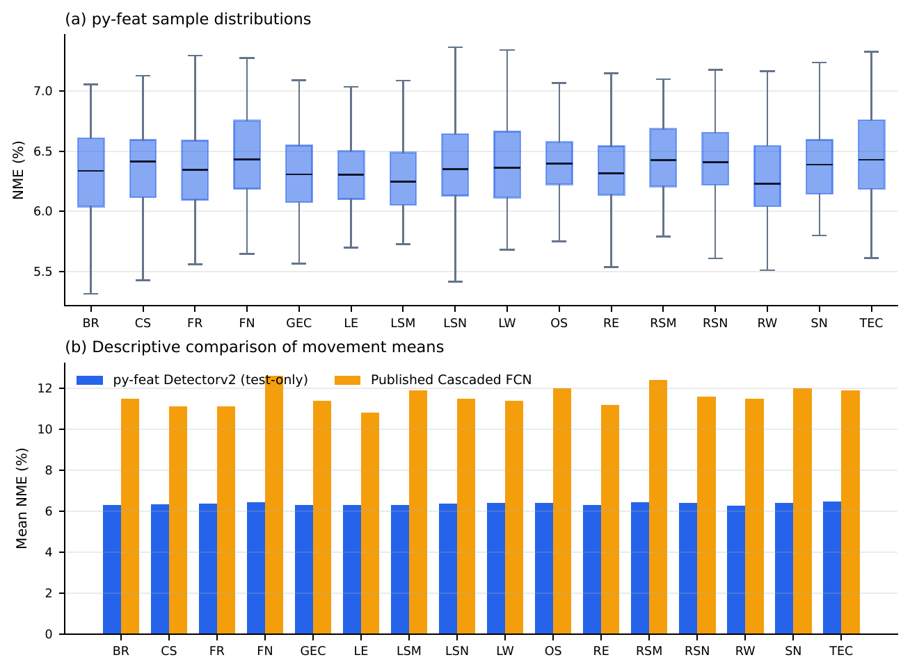
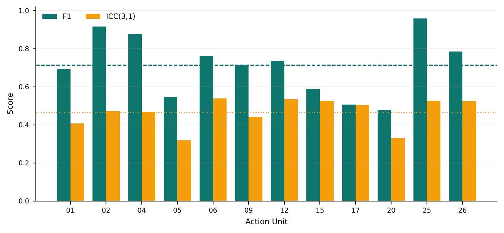

# MindPlus-Face 1차년도 과업 연계 주간 브리핑

## 브리핑 요약

- 전체 과제의 목표는 음성·안면·보행·시선 데이터를 함께 분석하여 알츠하이머병(AD), 파킨슨병(PD), 특발성 정상압수두증(iNPH)의 조기 선별과 감별진단을 지원하는 `MindPlus-Face` 진단보조 SaMD를 개발하는 것
- 경북대학교병원은 임상 지표 정의와 데이터 수집을, 경북대학교 의료정보학교실과 병원 AIMIC는 오픈소스 검토 및 Face Transformer 설계·프로토타입을 중심으로 Face 모달리티 개발을 추진
- 이번 주에는 1차년도 Face Transformer 설계·프로토타입 구축에 앞서, 오픈소스 후보인 Py-Feat가 랜드마크와 Action Unit(AU)을 안정적으로 추출할 수 있는지 공개 데이터셋으로 검증
- 랜드마크는 전 표본에서 검출되었고 평균 위치 오차는 `6.37%`, AU 검출 성능은 macro F1 `0.714`로 확인
- 이번 결과는 임상 진단 성능을 검증한 것이 아니라, 향후 Face 지표 정의와 수집 SOP를 구체화하기 위한 기술적 사전 검증에 해당

## 경북대병원·경북대의 1차년도 과업

| 1차년도 과업 | 주요 담당 | 주요 내용 | 목표 산출물 |
| --- | --- | --- | --- |
| Face 지표 정의 및 SOP 확립 | 경북대학교병원 신경과 | 구강 개구량, 입술 운동 속도·주기성, 좌우 비대칭, AU12·25·26, 음성-입모양 동기화 지표와 촬영 QC 기준 정의 | Face 지표 정의서 v1.0, QC 기준서 |
| IRB 기반 임상 데이터 수집 | 경북대학교병원 신경과 | 기승인 IRB를 기반으로 Face 추가 변경심의를 병행하고 NPH 50, AD 25, PD 25의 총 100세션 수집 | 임상 데이터 100세션, 품질 보고서 |
| Face Transformer 설계·프로토타입 | 경북대학교 의료정보학교실·병원 AIMIC | MediaPipe, OpenFace, Py-Feat 등 오픈소스 후보를 검토하고 비식별 랜드마크·AU 입력 구조와 시간축 분석 방향 설계 | 설계 문서, 랜드마크 추출 프로토타입 |

- 1차년도는 최종 질환 감별모델을 완성하는 단계가 아니라, 임상 지표·촬영 기준·데이터 수집 체계와 안면 특징 추출 기반을 확립하는 단계
- Face Transformer v1.0의 본격적인 학습과 임상 성능 검증은 이후 수집 데이터가 확보된 뒤 진행

## 이번 주 추진 내용

### 1. Py-Feat 기반 안면 특징 추출 후보 검증

- 기존 실시간 웹캠 프로토타입에서 확인한 랜드마크, AU, 머리 자세, 시선 등의 출력을 공개 데이터셋 평가로 확장
- 추가 학습이나 결과에 맞춘 기준 변경 없이 사전학습된 `Detectorv2`를 그대로 사용
- 평가 코드, 표본별 결과, 전체 요약, 표·그래프를 하나의 재현 가능한 결과 체계로 정리
- 연구 저장소를 Py-Feat 중심으로 재정비하고 평가 방법과 실행 절차를 문서화

### 2. 데이터셋별 평가 목적

| 데이터셋 | 데이터셋의 과제 | 프로젝트와의 연관성 | 평가 표본 |
| --- | --- | --- | ---: |
| AFLFP | 안면마비가 있는 얼굴의 16개 움직임에서 68개 랜드마크 위치를 찾는 과제 | 표정과 좌우 비대칭이 있는 상황에서도 얼굴 위치와 형태를 안정적으로 추적할 수 있는지 확인 | 1,136장 |
| DISFA | 자연스러운 표정 영상에서 12개 AU의 발생 여부와 강도를 분석하는 과제 | 구강·하악 지표와 관련된 AU12·25·26을 포함하여 얼굴 근육 움직임을 구분할 수 있는지 확인 | 5,400프레임 |

- AFLFP는 Face Transformer 입력이 될 랜드마크 좌표의 기본 정확도를 확인하기 위해 사용
- DISFA는 랜드마크만으로 설명하기 어려운 입꼬리, 입술 벌어짐, 턱 하강 등의 근육 움직임을 AU 단위로 확인하기 위해 사용
- 동일한 표본을 다시 선택할 수 있도록 고정된 기준으로 데이터를 구성하고, 랜드마크는 위치 오차, AU는 검출 F1을 중심으로 평가

## 주요 결과

| 평가 항목 | 결과 | 1차년도 과업 관점의 해석 |
| --- | ---: | --- |
| AFLFP 얼굴 검출 | `100%` | 평가 표본 전체에서 랜드마크 산출 가능 |
| AFLFP 평균 랜드마크 오차 | `6.37%` | 다양한 얼굴 움직임에서도 비교적 일정한 위치 추적 결과 확인 |
| DISFA AU 결과 산출 | `100%` | 평가 프레임 전체에서 AU 분석 가능 |
| DISFA 12개 AU 평균 성능 | macro F1 `0.714` | AU를 Face 보조 지표로 활용할 가능성과 AU별 추가 검증 필요성을 함께 확인 |
| 모델 추론 속도 | 약 `25~26 FPS` | 배치 기반 특징 추출의 처리 가능성 확인 |

### 핵심 결과 시각화

그림 1. AFLFP의 16개 얼굴 움직임별 랜드마크 오차 분포. 움직임별 평균 오차가 약 6%대에서 비교적 일정하게 나타났다. 아래의 기존 논문 결과는 평가 조건이 달라 직접적인 성능 비교가 아닌 참고값으로 사용했다.

그림 2. DISFA의 AU별 검출 성능(F1)과 강도 일치도(ICC). 점선은 각 지표의 전체 평균이며, 프로젝트 핵심 지표인 AU12·25·26의 F1은 각각 `0.737`, `0.959`, `0.785`였다.

### 1차년도 핵심 AU 결과

| AU | 프로젝트에서의 의미 | F1 |
| --- | --- | ---: |
| AU12 | 입꼬리 당김 | `0.737` |
| AU25 | 입술 벌어짐 | `0.959` |
| AU26 | 턱 하강·입 벌림 | `0.785` |

- 구강·하악 지표와 직접 연결되는 AU12·25·26에서 모두 결과를 산출할 수 있었고, 특히 AU25의 검출 성능이 높게 나타남
- 전체 평균만으로 판단하기에는 AU별 성능 편차가 있으므로, 향후 SOP에는 필요한 AU를 개별적으로 검증하고 기록하는 절차가 필요
- AFLFP의 과거 논문 기준값보다 낮은 오차를 확인했으나 평가 조건이 다르므로 직접적인 성능 우위가 아닌 참고 결과로 해석
- 약 `25~26 FPS`는 모델 추론 구간만 측정한 값이며, 실제 촬영·전송·화면 표시를 포함한 수집 시스템의 전체 속도와는 다름

## 1차년도 과업 대비 이번 주 진척

| 1차년도 과업 | 이번 주 기여 | 현재 상태 |
| --- | --- | --- |
| Face 지표 정의 및 SOP | 랜드마크 오차와 AU별 F1을 후보 검증 지표로 정리하고, AU12·25·26의 기초 성능을 확인 | 진행 중 |
| Face Transformer 설계·프로토타입 | Py-Feat 기반 랜드마크·AU 추출 흐름과 재현 가능한 평가 체계 구축 | 진행 중 |
| 오픈소스 후보 검토 | Py-Feat의 실제 출력, 처리 속도, 장단점과 활용 범위를 공개 데이터로 확인 | 1차 검증 완료 |
| IRB 기반 100세션 수집 | 이번 주 평가는 공개 데이터만 사용했으며 임상 데이터 수집 실적에는 포함되지 않음 | 별도 추진 필요 |
| 공동 연계 항목(DAS 정합성) | 이번 주에는 임상 DAS 점수를 사용하지 않아 정합성은 아직 평가하지 않음 | 대구대학교와 협업이 필요한 후속 과업 |

## 현재 판단

- Py-Feat는 랜드마크·AU 추출 결과를 빠르게 확인하고 품질을 비교하는 연구용 후보 및 보조 검증 도구로 활용 가능
- 이번 평가를 통해 Face Transformer 입력 후보와 평가 방법을 구체화했지만, Py-Feat를 최종 임상 모델로 확정한 것은 아님
- AFLFP는 68개 랜드마크의 단일 이미지 평가이고 DISFA는 일반 표정 영상이므로, 실제 `Task 2(AMR/SMR)`와 `Task 5(문단읽기)`의 구강·하악 시계열 성능을 직접 검증한 결과는 아님
- 질환 감별 성능, DAS와의 정합성, 임상적 유효성은 IRB 기반 데이터가 확보된 이후 별도로 검증해야 함

## 다음 추진 계획

- Task 2와 Task 5에 사용할 입술·턱 중심 랜드마크 ROI 및 AU12·25·26 출력 형식 정의
- MediaPipe, OpenFace, Py-Feat를 동일 영상에서 비교하여 랜드마크 검출률, 흔들림, AU 일관성 점검
- 조명, 안면 가림, 머리 자세, 프레임 유실을 포함한 Face QC 기준과 자동 경고 항목 구체화
- 구강 개구량, 입술 속도·주기성, 좌우 비대칭 계산 방법을 포함한 Face 지표 정의서/SOP 초안 반영
- 임상 수집 전 소규모 촬영 리허설을 통해 실제 환경의 검출 성공률과 QC 통과율 확인

## 결과물

- [최종 Benchmark PDF](../../output/pdf/pyfeat_testonly_benchmark.pdf)
- [AFLFP 결과 요약](../../paper/results/aflfp-test.md)
- [DISFA 결과 요약](../../paper/results/disfa-test.md)
- [실험 재현 방법](../../paper/README.md)
