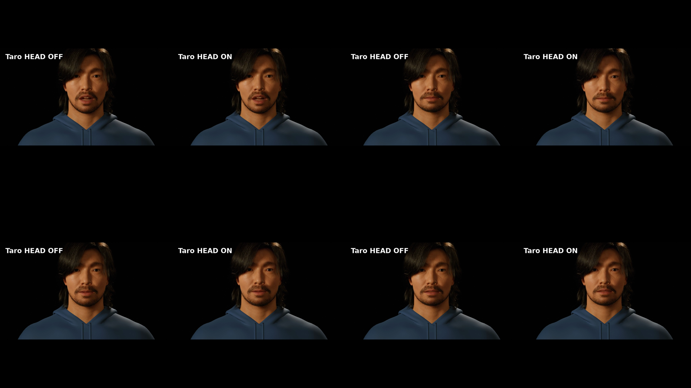

# Audio2Face-3D + MetaHuman CLI 핸즈온 튜토리얼 주간 작업일지

## Audio2Face-3D + MetaHuman CLI 개요

- 입력 음성으로 MetaHuman이 말하는 영상을 만드는 전체 과정을 한국어 핸즈온 튜토리얼로 정리
- 처음 사용하는 사람도 한 번의 기본 실행부터 시작해 구도, 아바타, 모션 강도, 얼굴 파라미터와 감정을 단계적으로 조절할 수 있도록 실습 순서 재구성
- 설명용 개념도와 아키텍처를 특정 샘플에 종속되지 않는 일반적인 사용자 흐름으로 개선
- 그래프나 기준 얼굴 대신 실제 MetaHuman 렌더를 감정 조절 결과로 제시
- 영상 생성뿐 아니라 음성 포함 여부, 재생 가능 여부와 얼굴 움직임 동기까지 확인하는 검증 절차 포함

### 주요 검증 결과

| 검증 항목             | 확인 결과                                                                  |
| --------------------- | -------------------------------------------------------------------------- |
| 기본 실습 흐름        | 입력 준비부터 최종 영상 확인까지 복사·실행 가능한 순서로 정리              |
| 조절 항목             | 구도, 카메라, 아바타, 모션 강도, 얼굴 파라미터와 감정 실습 포함            |
| 영상 결과 예시        | 1920×1080, 30 fps, 109 frames, H.264/AAC, 전체 decode PASS                 |
| 음성·얼굴 동기        | A/V 시작 차이 `0 ms`, 얼굴 움직임 content lag `0 frame` 확인               |
| 감정 결과             | 동일 아바타·음성·구도에서 기본 표정과 joy `0.7`의 실제 MetaHuman 렌더 비교 |
| 카메라 결과           | 네 가지 구도를 실제 렌더로 확인하고 `profile-left` 표기 수정               |
| 아바타 선택           | Taro, Keiji, Sook-ja에 같은 음성 기반 얼굴 애니메이션 적용                 |
| 표정 강도             | 같은 장면에서 기본 강도와 dynamic-safe 강도의 얼굴 반응 비교               |
| 머리 움직임           | 동일 음성·얼굴·카메라 OFF/ON 렌더에서 실제 목·머리 움직임과 동기 보존 확인 |
| 전체 관련 테스트      | `221 passed, 269 subtests passed`                                          |
| 핸즈온 문서 계약 테스트 | `14 passed, 156 subtests passed`                                         |

> 영상 수치는 `test.wav`로 수행한 이번 검증 예시에 해당한다. 모든 입력에서 동일한 길이와 frame 수를 보장하는 값은 아니다. 감정 비교는 실제 MetaHuman 영상에서 추출한 화면이며, 전체 자동 합성 흐름은 수정된 감정 설정으로 한 번 더 확인할 예정이다.

## Weekly Done

- 튜토리얼 첫 화면에서 결과와 기본 실행 방법을 바로 이해할 수 있도록 학습 흐름 정리
- Audio2Face, MetaHuman, 렌더 등 처음 접하는 용어를 쉬운 한국어로 설명
- 오디오 입력부터 얼굴 움직임 생성, 캐릭터 적용, 영상 렌더와 결과 확인까지 이어지는 개념도 제작
- 복잡한 내부 용어를 줄이고 다섯 단계로 읽히는 초보자용 아키텍처 제작
- 여러 시각화 후보를 비교하고, 글자·수치·화살표 방향을 검수한 최종 그림 선정
- 학습에 불필요한 모델 비교 내용을 제거하고 한 가지 기본 실행 경로에 집중
- 네 가지 카메라 구도를 실제 결과 화면으로 정리하고 잘린 라벨 수정
- 감정 결과를 실제 MetaHuman 렌더 비교로 교체하고 동일 조건에서 차이를 확인할 수 있도록 구성
- 감정 입력 형식의 누락 가능성을 보완하고 기본 감정과 시간 변화 감정을 일관된 형식으로 처리하도록 검증
- 시간 변화 감정은 최종 캐릭터 영상까지 검증된 기능으로 과장하지 않고 고급 기능의 현재 경계로 구분
- 전체 튜토리얼과 연결된 화면, 결과 자료와 테스트를 다시 확인
- 입력 음성에 반응하는 opt-in 머리 움직임을 실제 MetaHuman 목·머리 animation으로 적용
- 동일 조건 OFF/ON 영상에서 카메라와 얼굴 curve를 보존하면서 bounded nonzero 움직임을 확인
- 초보자용 핸즈온을 Quick Start부터 검증·복구·CLI reference까지 15개 절로 재구성
- 실제 terminal/GUI/MRQ pixel을 사용한 번호형 screenshot 9장과 source/crop/SHA provenance를 구축

## 주요 결과 화면

### 전체 실습 흐름

오디오 입력에서 얼굴 애니메이션, 선택한 MetaHuman, 카메라 렌더와 검증 결과까지 이어지는 과정을 한눈에 볼 수 있도록 정리했다.

### 초보자용 실행 아키텍처

사용자가 실제로 수행하는 순서에 맞춰 모든 화살표를 왼쪽에서 오른쪽으로 통일했다.

### 다양한 카메라 구도 결과

같은 아바타와 음성을 유지한 채 정면 클로즈업, 좌·우 3/4 구도와 왼쪽 측면 구도를 적용했다. 한 번의 음성 입력으로 목적에 맞는 여러 구도의 영상을 만들 수 있음을 실제 렌더로 확인했다.

### 아바타 선택 결과

같은 Audio2Face 얼굴 애니메이션 흐름을 Taro, Keiji, Sook-ja에 적용했다. 사용자는 아바타 이름을 선택하는 방식으로 캐릭터를 바꾸면서 동일한 음성 기반 영상 생성을 반복할 수 있다.

### 표정 강도 조절 결과

같은 Taro, 음성, 카메라와 시점을 유지하고 기본 강도와 dynamic-safe 강도를 비교했다. 강도 설정은 입과 얼굴 부위의 움직임 범위를 조절하며, 아래 결과는 강도 변화에 따른 실제 렌더 반응 차이를 보여준다.

### 실제 MetaHuman 감정 결과

같은 캐릭터, 음성, 카메라와 렌더 조건에서 기본 표정과 joy `0.7`을 비교했다. 아래 화면은 생성 이미지나 기준 얼굴이 아니라 실제 MetaHuman 영상에서 가져왔다.

### 자연스러운 머리 움직임 결과

고정 카메라와 같은 음성·얼굴 애니메이션을 유지한 채 머리 움직임 OFF/ON을 비교했다. ON 결과는 카메라나 캐릭터 전체 이동이 아니라 run-owned Body/Face animation의 목·머리 bone을 구동한다. 실제 렌더에서 회전 RMS `0.154°`, p95 `0.296°`의 작고 부드러운 움직임이 확인됐다. 얼굴 보정으로 전체 avatar 영상이 이동하는 문제도 같은 avatar/shot의 실측값으로 bone bake를 사전 보상해, A/V `0 ms`, 얼굴 lag `0 frame`, 머리 pose lag `-1 frame`(허용 ±1)과 전체 decode PASS를 유지했다.

Taro뿐 아니라 로컬에 설치된 Keiji, Sook-ja, Jesse에도 동일한 run-owned bone bake를 적용했다. 네 avatar 모두 얼굴 lag 0, 머리 lag ±1 frame 이내와 H.264/AAC·109 frames·A/V 0 ms·full decode를 통과했다. Keiji, Sook-ja, Jesse는 원본 의상 Vulkan 위험과 분리된 안전 프로필로 검증했다.

## Weekly TODO

- [ ] 수정된 상수 감정 설정으로 전체 영상 생성 과정을 한 번 더 실행해 최종 결과 확인
- [x] 로컬 머리 움직임 OFF/ON 최종 MetaHuman 렌더, 본 키, 실영상 움직임과 동기 보존 검증
- [x] 로컬 MetaHuman 네 명의 head-motion 최종 렌더 및 cross-avatar lag/R² 검증
- [ ] 시간 변화 감정은 최종 MetaHuman 렌더 적용 범위가 검증될 때까지 고급 제한으로 유지
- [ ] Gate 2 검토 후 관련 변경을 커밋
